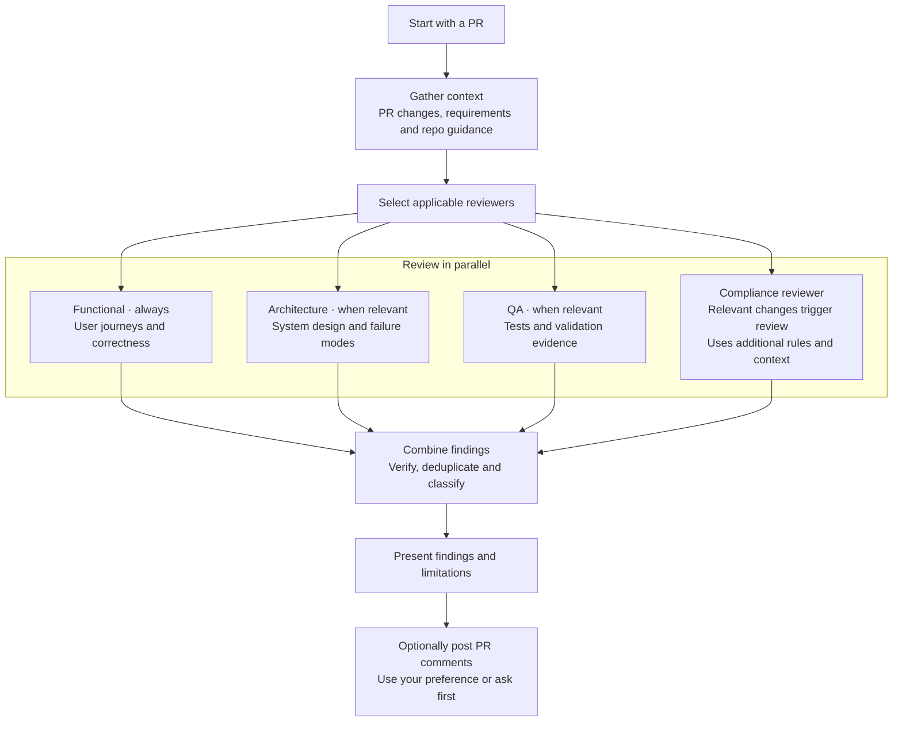
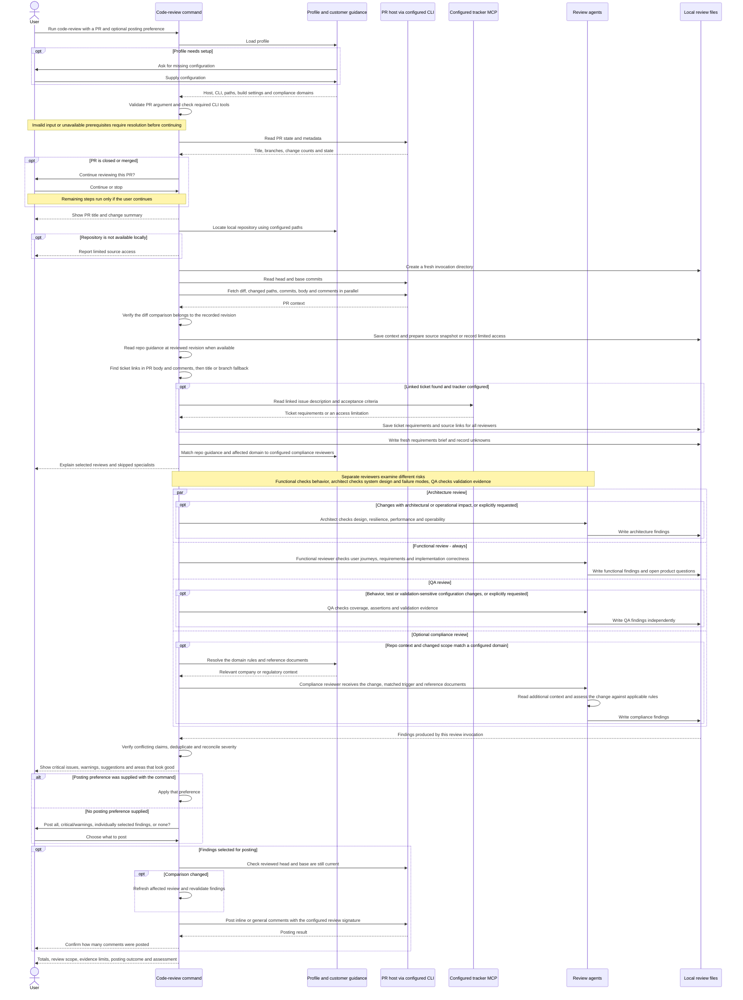

# Running a code review

## When to use this skill

Use this skill when a PR is ready for review and you want to check that it meets
the requirements, works through the affected user journeys, and handles relevant
failure scenarios.

## Motivation

A PR needs to be assessed from several perspectives: whether it delivers the
requested behavior, preserves user journeys, handles system failures, and has
meaningful test coverage. Some changes also require checking specific compliance
rules. Covering those perspectives is a substantial part of a developer's review.

The motivation for this skill is to bring those reviews together and shorten the
path to a useful assessment. It connects the PR to its requirements, runs the
relevant specialist reviews in parallel, and consolidates their findings into
prioritized concerns, supporting evidence and an overall conclusion. The developer
can use that assessment alongside their own independent review, verifying the
findings and deciding what needs attention before merge.

## Usage

Start with `/raholsn:code-review <PR URL or owner/repo#number>`.
Optionally append `post_comments=all`, `post_comments=critical_warnings`, or
`post_comments=none` to choose the posting behavior up front.

## Workflow

### High-level overview

The diagram shows the main stages of the
[`code-review` workflow](../claude-plugin/skills/code-review/code-review.md).
Selected reviewers work in parallel, each looking at a different kind of risk.

### Detailed sequence

Detailed sequence: setup, review coordination and posting

This diagram expands the overview above into the individual interactions.
It describes the workflow, not a recorded execution.

## Context and requirements

Setup loads the profile and checks PR access. Missing configuration or unclear
requirements may need your input; a closed or merged PR requires confirmation
to continue. Linked ticket requirements are fetched once and shared with all
reviewers. Missing context is recorded as a limitation.

Reviewers read surrounding source and tests at the recorded PR revision, using
an isolated snapshot or revision-specific host content. Missing source is
reported as a limitation. The user's working checkout is preserved.

## Review responsibilities

| Agent | Main question | Scope |
|---|---|---|
| Functional reviewer | Can the user complete the intended journey, and does the implementation deliver the agreed behavior correctly? | Journey entry and prerequisites, connected steps, progress and outcome feedback, interruption and recovery, acceptance criteria, business rules, calculations, state transitions, permissions, and regressions. Uses available client/API evidence and flags missing product decisions without inventing requirements. |
| Architect | Will the affected system remain correct, resilient, efficient, and operable as load and failure conditions change? | Boundaries, contracts, data consistency, idempotency, retryability, timeout budgets, concurrency, performance, scalability, resource limits, backpressure, caching, security isolation, observability, recovery, rollout/rollback, and maintainability. |
| QA | What evidence demonstrates that the change works and continues to work? | Requirement-to-test coverage, meaningful assertions, test isolation and reliability, boundary/failure scenarios, integration and regression coverage, and appropriate concurrency/load/recovery validation. Distinguishes passing results from tests that were never run. |
| Compliance reviewer | Does the change satisfy the rules that apply to this area? | Runs when configured triggers match the change or repository requirements. Reads supplied domain rules, company documents, and relevant requirements before assessing the implementation. Reports missing context as unreviewed. |

### How the reviewers complement each other

For example, the architect checks whether retrying after a timeout can duplicate
a side effect and whether retries fit the caller's time budget. The functional
reviewer checks that the resulting state and response meet the agreed behavior.
QA checks whether validation actually exercises the timeout, retry, and duplicate
delivery scenarios and asserts the outcomes.

Architectural review follows relevant risks through the affected system rather
than stopping at class or service structure. Findings need a concrete scenario,
evidence, and impact; speculative scale assumptions are recorded as questions.
These scopes establish primary responsibility, not restrictions on reporting a
real defect found by another reviewer.

### Selecting reviewers

Functional review runs for every PR. Explicitly requested specialists also run.
Small documentation or cosmetic changes normally skip architecture and QA.

## Compliance review

### When it runs

Compliance review is enabled selectively through the profile. Each registered
reviewer has a trigger identifying the area it covers. The command compares
those triggers with the changed code, affected behavior, task requirements, and
repository guidance. A matching change brings that reviewer into the parallel
review; a repo-wide requirement can also trigger it. Several matches can run
several compliance reviewers.

For example, a configured payment-processing reviewer could be selected for a
change to payment handling. It would receive the PR diff and shared requirements,
the reason its trigger matched, and the relevant payment rules or company
documents. This example does not impose payment rules on other repositories.

### Additional context

The profile's customer pack supplies additional reference documents through
`knowledge.domains`; repository guidance and the task brief can name further
references. The reviewer reads that context alongside any domain references
configured in its own agent definition before judging the change. It cites the
rules it used and explains why they apply.

An ambiguous match may need clarification. Missing reviewers, unreadable
references, or uncertain applicable rules are reported as unreviewed areas.
Having no configured compliance reviewer does not establish that no obligations
apply.

## Findings and validation

The command creates `task.md` before dispatching, records missing requirements,
and consolidates only feedback from the current invocation. Single-pass review
does not require a build. Missing evidence limits the final assessment.

Reviewers report independently; the command deduplicates their findings and
reconciles severity using the impact-based definitions in each agent. Missing
tests alone are not critical defects.
QA assesses configuration, retries, recovery, and data-integrity validation by
their concrete risk, including when broader validation runs only after merge.

## Posting comments

The command uses your `post_comments` preference or asks which findings to post.
Before posting, it checks that the reviewed PR revision is still current and
revalidates affected findings if it changed.

## Results and saved files

The review writes its working files to
`<roots.artifacts>/review-<repo>-<pr-number>/run-<unique-id>`. It presents findings
without applying code fixes or merging the PR. The final report includes the
review assessment, evidence limitations and posting outcome. Build verification
is optional; a review result does not establish that tests passed.
