# Command dependencies

One chart of all 15 commands registered in the [plugin manifest](../claude-plugin/.claude-plugin/plugin.json), all 21 bundled `ref-*` skills, and the agents that connect them. Arrows point **from the caller to its dependency**. This is a source dependency reference, not an execution timeline: optional steps depend on scope, configuration and authorization.

Read left to right: commands → workflow/review references → agents → shared
checks and guidance. Some commands also call shared checks directly.

Each command has its own line color, matched by its node border. Shared reference
calls and agent preloads use neutral lines; arrow styles distinguish them.

| Command | Color | Command | Color |
|---|---|---|---|
| Work | Blue | Code Review | Purple |
| Fix Comments | Orange | Logs | Cyan |
| SQL Server Reader | Green | Create Linear Ticket | Pink |
| Write Requirements | Gold | Plan Implementation | Teal |
| Profile | Indigo | Grill Me Pragmatic | Rose |
| Get Deploy Status | Sky | Show Pull Requests | Olive |
| Open Solution | Magenta | Open Argo | Brown |
| RabbitMQ | Slate blue | | |

Profile and Grill Me Pragmatic have no outgoing dependencies. Their colors
identify their nodes without adding artificial lines.

- **Colored-border rectangles:** user commands. **Thick arrows:** command-to-command composition (currently `profile`), with conditional calls labeled.
- **Neutral-border rectangles:** internal reference skills. **Solid arrows:** explicit reference use or agent delegation; labels identify conditional calls. Follow multiple arrows for transitive dependencies; shared references appear only once.
- **Green-border diamonds:** bundled agents. **Unlabeled dashed arrows:** agent frontmatter preloads reference context. Preflight also applies its five preloaded checks; their individual applicability still comes from the source.
- **Dashed naming-reference arrow:** `work` reads branch/title guidance from `ref-create-branch-and-pr`; it does not run that reference's combined branch/push/PR helper.
- **Gold-border diamond:** domain reviewers supplied by configuration, whose own dependencies are outside this plugin's fixed graph.

```mermaid
%%{init: {"flowchart": {"defaultRenderer": "elk", "nodeSpacing": 35, "rankSpacing": 100, "curve": "linear"}}}%%
flowchart LR
    subgraph commands["Commands"]
        direction TB
        work["Work"]:::command
        code_review["Code Review"]:::command
        fix_comments["Fix Comments"]:::command
        logs["Logs"]:::command
        rabbitmq["RabbitMQ"]:::command
        sql_server_reader["SQL Server Reader"]:::command
        create_linear_ticket["Create Linear Ticket"]:::command
        grill_me_pragmatic["Grill Me Pragmatic"]:::command
        write_requirements["Write Requirements"]:::command
        plan_implementation["Plan Implementation"]:::command
    end
    subgraph scripts["Local script commands"]
        direction TB
        get_deploy_status["Get Deploy Status"]:::command
        show_pullrequests["Show Pull Requests"]:::command
        open_solution["Open Solution"]:::command
        open_argo["Open Argo"]:::command
    end
    subgraph script_tools["Bundled scripts"]
        direction TB
        tool_get_deploy_status["get-deploy-status.sh"]:::script
        tool_show_pullrequests["show-pullrequests.sh"]:::script
        tool_open_solution["open-solution.sh"]:::script
        tool_open_argo["open-argo.sh"]:::script
    end
    subgraph workflow["Task and delivery references"]
        direction TB
        ref_work_session["Work Session"]:::reference
        ref_understand_task["Understand Task"]:::reference
        ref_apply_feedback["Apply Feedback"]:::reference
        ref_delivery_planning["Delivery Planning"]:::reference
        ref_context_usage_report["Context Usage"]:::reference
        ref_create_branch_and_pr["Create Branch & PR"]:::reference
        ref_update_pr_description["Update PR Description"]:::reference
        ref_session_retrospective["Session Retrospective"]:::reference
    end
    subgraph reviews["Review and validation references"]
        direction TB
        ref_architect_review["Architecture Review"]:::reference
        ref_compliance_review["Compliance Review"]:::reference
        ref_review_loop["Review Loop"]:::reference
        ref_qa_review["QA Review"]:::reference
        ref_post_push_review["Post-Push Review"]:::reference
        ref_build_and_test["Build & Test"]:::reference
    end
    subgraph agents["Agents"]
        direction TB
        agent_preflight{"Preflight"}:::agent
        agent_cross_repo_explorer{"Cross-Repo Explorer"}:::agent
        agent_architect{"Architect"}:::agent
        agent_planner{"Planner"}:::agent
        agent_functional_reviewer{"Functional Reviewer"}:::agent
        agent_comment_fixer{"Comment Fixer"}:::agent
        agent_qa{"QA"}:::agent
        agent_retrospective{"Retrospective"}:::agent
        domain_agent{{"Domain Reviewers"}}:::external
    end
    subgraph checks["Readiness checks"]
        direction TB
        ref_ticket["Ticket Check"]:::reference
        ref_cli_check["CLI Check"]:::reference
        ref_service_check["Service Check"]:::reference
        ref_mcp_check["MCP Check"]:::reference
        ref_git_preflight["Git Check"]:::reference
    end
    subgraph shared["Shared configuration and guidance"]
        direction TB
        profile["Profile"]:::command
        ref_company_conventions["Company Conventions"]:::reference
        ref_company_testing["Company Testing"]:::reference
    end
  work ==> profile
  code_review ==> profile
  fix_comments ==> profile
  logs ==> profile
  sql_server_reader ==> profile
  create_linear_ticket ==> profile
  write_requirements ==>|"publishing only"| profile
  plan_implementation ==>|"tracker source or publishing"| profile
  work --> ref_work_session
  work --> ref_understand_task
  work --> ref_architect_review
  work --> ref_compliance_review
  work --> ref_apply_feedback
  work --> ref_delivery_planning
  work --> ref_context_usage_report
  work --> ref_build_and_test
  work --> ref_review_loop
  work --> ref_session_retrospective
  work -.->|"naming reference only"| ref_create_branch_and_pr
  work -->|"existing PR; authorized"| ref_update_pr_description
  work -->|"authorized review/fix pass"| ref_post_push_review
  work --> agent_preflight
  work -->|"broad / cross-repo discovery"| agent_cross_repo_explorer
  code_review --> ref_cli_check
  code_review -->|"single-pass"| ref_review_loop
  code_review -->|"when selected / applicable"| ref_architect_review
  code_review -->|"when selected / applicable"| ref_qa_review
  code_review -->|"when selected / applicable"| ref_compliance_review
  fix_comments --> ref_cli_check
  fix_comments -->|"code changed; or equivalent checks"| ref_build_and_test
  fix_comments -->|"optional delegation"| agent_comment_fixer
  logs --> ref_mcp_check
  create_linear_ticket --> ref_mcp_check
  agent_architect -.-> ref_company_conventions
  agent_architect -.-> ref_company_testing
  agent_comment_fixer -.-> ref_company_conventions
  agent_comment_fixer -.-> ref_company_testing
  agent_functional_reviewer -.-> ref_company_conventions
  agent_functional_reviewer -.-> ref_company_testing
  agent_planner -.-> ref_company_conventions
  agent_planner -.-> ref_company_testing
  agent_preflight -.-> ref_ticket
  agent_preflight -.-> ref_cli_check
  agent_preflight -.-> ref_service_check
  agent_preflight -.-> ref_mcp_check
  agent_preflight -.-> ref_git_preflight
  agent_qa -.-> ref_company_conventions
  agent_qa -.-> ref_company_testing
  agent_retrospective -.-> ref_company_conventions
  agent_retrospective -.-> ref_company_testing
  ref_architect_review --> agent_architect
  ref_delivery_planning --> agent_planner
  ref_qa_review --> agent_qa
  ref_session_retrospective --> agent_retrospective
  ref_review_loop -->|"default reviewer"| agent_functional_reviewer
  ref_post_push_review --> agent_functional_reviewer
  ref_post_push_review --> agent_comment_fixer
  ref_compliance_review -->|"matched configured domains"| domain_agent
  ref_review_loop -->|"loop fixes: default re_verify"| ref_build_and_test
  get_deploy_status --> tool_get_deploy_status
  show_pullrequests --> tool_show_pullrequests
  open_solution --> tool_open_solution
  open_argo --> tool_open_argo
  rabbitmq ==> profile
  rabbitmq ==>|"relevant evidence and configured logs"| logs
  style rabbitmq stroke:#475569,stroke-width:2.5px
  linkStyle 63,64 stroke:#475569,stroke-width:3.5px
  classDef script stroke:#64748b,stroke-width:1.5px,stroke-dasharray:4 3
  classDef command stroke-width:2px
  classDef reference stroke:#64748b,stroke-width:1.5px
  classDef agent stroke:#16a34a,stroke-width:2px
  classDef external stroke:#ca8a04,stroke-width:2px
  style commands fill:transparent,stroke:#64748b,stroke-width:1px
  style workflow fill:transparent,stroke:#64748b,stroke-width:1px
  style reviews fill:transparent,stroke:#64748b,stroke-width:1px
  style agents fill:transparent,stroke:#64748b,stroke-width:1px
  style checks fill:transparent,stroke:#64748b,stroke-width:1px
  style shared fill:transparent,stroke:#64748b,stroke-width:1px
  style work stroke:#3b82f6,stroke-width:2.5px
  style code_review stroke:#a855f7,stroke-width:2.5px
  style fix_comments stroke:#ea580c,stroke-width:2.5px
  style logs stroke:#0891b2,stroke-width:2.5px
  style sql_server_reader stroke:#16a34a,stroke-width:2.5px
  style create_linear_ticket stroke:#db2777,stroke-width:2.5px
  style write_requirements stroke:#ca8a04,stroke-width:2.5px
  style plan_implementation stroke:#0d9488,stroke-width:2.5px
  style profile stroke:#6366f1,stroke-width:2.5px
  style grill_me_pragmatic stroke:#e11d48,stroke-width:2.5px
  style scripts fill:transparent,stroke:#64748b,stroke-width:1px
  style script_tools fill:transparent,stroke:#64748b,stroke-width:1px
  style get_deploy_status stroke:#0284c7,stroke-width:2.5px
  style show_pullrequests stroke:#65a30d,stroke-width:2.5px
  style open_solution stroke:#c026d3,stroke-width:2.5px
  style open_argo stroke:#a16207,stroke-width:2.5px
  linkStyle 0 stroke:#3b82f6,stroke-width:3.5px
  linkStyle 1 stroke:#a855f7,stroke-width:3.5px
  linkStyle 2 stroke:#ea580c,stroke-width:3.5px
  linkStyle 3 stroke:#0891b2,stroke-width:3.5px
  linkStyle 4 stroke:#16a34a,stroke-width:3.5px
  linkStyle 5 stroke:#db2777,stroke-width:3.5px
  linkStyle 6 stroke:#ca8a04,stroke-width:3.5px
  linkStyle 7 stroke:#0d9488,stroke-width:3.5px
  linkStyle 8,9,10,11,12,13,14,15,16,17,18,19,20,21,22 stroke:#3b82f6,stroke-width:2px
  linkStyle 23,24,25,26,27 stroke:#a855f7,stroke-width:2px
  linkStyle 28,29,30 stroke:#ea580c,stroke-width:2px
  linkStyle 31 stroke:#0891b2,stroke-width:2px
  linkStyle 32 stroke:#db2777,stroke-width:2px
  linkStyle 33,34,35,36,37,38,39,40,41,42,43,44,45,46,47,48,49,50,51,52,53,54,55,56,57,58 stroke:#64748b,stroke-width:1.5px
  linkStyle 59 stroke:#0284c7,stroke-width:2px
  linkStyle 60 stroke:#65a30d,stroke-width:2px
  linkStyle 61 stroke:#c026d3,stroke-width:2px
  linkStyle 62 stroke:#a16207,stroke-width:2px
```

`rabbitmq` resolves connection settings through `profile` and conditionally calls
`logs` for application evidence. Its HTTP API requests and optional Kubernetes
tunnel are external operations, not additional bundled skills. See the
[RabbitMQ guide](rabbitmq.md).

The four local script commands directly run their matching bundled `.sh` files
from the plugin tools directory, shown with dashed node borders. They do not invoke `profile` or the `work` workflow. See
[local script commands](local-script-commands.md) for their invocation rules.

The suggested planning sequence is `grill-me-pragmatic` → `write-requirements` → `plan-implementation` → `work`. These are user-selected handoffs, so they are not invocation arrows. `grill-me-pragmatic` and `profile` have no bundled reference dependencies; `write-requirements`, `plan-implementation` and `sql-server-reader` reach configuration through `profile` but call no `ref-*` skills themselves.

`work` lists preflight references in its composition inventory, but its phase instructions delegate those checks to `preflight`; the graph shows that actual route. It uses `ref-post-push-review` for an authorized review/fix pass rather than invoking the standalone `code-review` or `fix-comments` commands. Creating a ticket is likewise a separate command, not an automatic dependency of `work` or `ref-ticket`.

`ref-review-loop` can accept another reviewer and another validation call; the chart shows its default reviewer and default validation reference. Its validation edge applies to loop-mode fixes, not the `code-review` command's single-pass review. `ref-post-push-review` requests the caller's validation after code changes without naming a fixed validation skill. Architecture/compliance feedback is applied by `work` through its own `ref-apply-feedback` call; those reviewers do not invoke it themselves.

The company references hold conventions and testing guidance configured directly for the current assignment. Explicitly supplied or profile-selected documents can override those sections. Pack documents, repository guidance, external services, other scripts and external agents' preloads are not expanded as bundled skill dependencies. Passing an effective profile to an agent is context, not a new `profile` command invocation.

Source directories: [command and reference definitions](../claude-plugin/skills/) and [agent definitions](../claude-plugin/agents/). The manifest defines command coverage; reference bodies define calls and agent frontmatter defines preloads. Update this chart when any of those relationships change.
