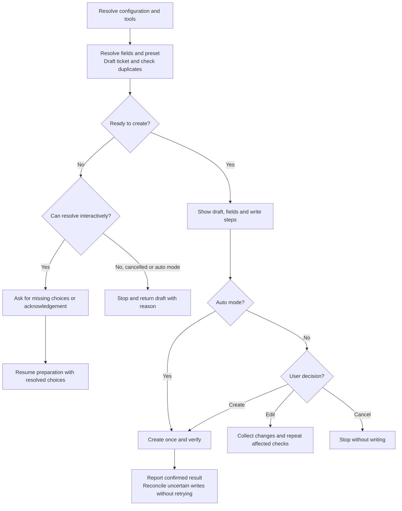
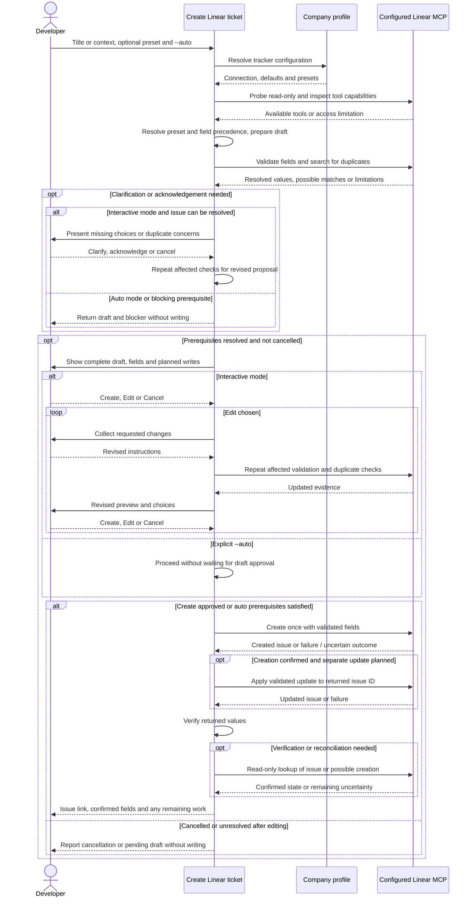

# Creating tickets with create-linear-ticket

## When to use this skill

Use `/raholsn:create-linear-ticket` to turn a title or problem description into
one Linear ticket. Company configuration supplies the connection, defaults and
optional presets. Use `--auto` when you want creation without manual intervention
and have supplied enough information to resolve the ticket.

## Motivation

Each developer has their own Linear user and works with particular projects and
milestones. Repeating those choices for every ticket takes time and makes it easy
to assign work to the wrong person or place it in the wrong project. Profile
defaults and reusable presets capture that context so the skill can apply it
consistently, while explicit instructions can override it for an individual ticket.

The skill also resolves the team and status, checks for possible duplicates and
prepares a reviewable description before writing. It keeps facts, open questions
and proposed acceptance criteria distinguishable.

## Usage

```text
/raholsn:create-linear-ticket Investigate payment timeouts
/raholsn:create-linear-ticket Investigate payment timeouts --preset-name
/raholsn:create-linear-ticket Investigate payment timeouts --preset-name --auto
```

Replace `--preset-name` with a configured preset name or flag alias.

| Mode | Behavior |
|---|---|
| Default | Prepare the draft, resolve questions and wait for Create, Edit or Cancel. |
| `--auto` | Validate and show the draft, then create without waiting if all prerequisites are satisfied. Stop and report anything requiring clarification or acknowledgement. |

`--auto` applies only when explicitly supplied as a standalone flag for this
invocation. It is not inherited from earlier requests or profile defaults, and
quoted examples do not enable it. The flag is excluded from the ticket content.

## Workflow

### High-level overview

These diagrams describe the instructions in the
[`create-linear-ticket` skill](../claude-plugin/skills/create-linear-ticket/create-linear-ticket.md),
not a recorded execution.



### Detailed sequence

<details>
<summary>Expand preparation, approval and failure handling</summary>



</details>

## Your decisions

| Choice | Result |
|---|---|
| **Create** | Approve the displayed draft, fields and any necessary follow-up update. |
| **Edit** | Revise the draft, repeat affected checks and request fresh approval. |
| **Cancel** | Stop without creating or modifying a ticket. |

Silence, ambiguous replies and preselected options do not authorize creation.
A plausible duplicate requires an explicit decision to create a separate ticket.
An incomplete duplicate search requires acknowledgement of that limitation.
The command does not update a duplicate issue instead of creating the requested one.

In `--auto` mode, these unresolved decisions cause a stop with the draft and
reason. The skill does not ask questions, guess required values or retry failed
writes to keep the run going. Nonblocking unknowns can remain in the description.

## Configuration and field precedence

Configure the Linear connection through the [company profile](profile.md).
Set the defaults and presets to reflect the developer using that profile: an
assignee default can be `me`, and presets can hold the projects and milestones
they commonly use. `me` refers to the user authenticated by the configured Linear
connection; it does not select or switch accounts.

| Setting | Purpose |
|---|---|
| `tracker.type` | `linear` |
| `tracker.mcp` | Configured Linear MCP connection |
| `tracker.probe_call` | Optional read-only connection probe |
| `tracker.create_call`, `tracker.status_call` | Tool hints checked against exposed capabilities |
| `tracker.update_call` | Optional hint when a separate update is necessary |
| `tracker.defaults` | Default team, assignee, state and optional ticket fields |
| `tracker.presets` | Named field bundles with flag or phrase aliases |

For each field, explicit user instructions override the selected preset, which
overrides profile defaults. Missing optional fields are omitted. The team and
intended status must be resolved. This applies to assignee, project, milestone,
labels, priority and due date as well. Labels replace the lower-precedence list
unless you explicitly request additions.

An explicit flag selects a preset. Plain-prose mentions only suggest one and
require confirmation. Multiple presets require a choice rather than an automatic
merge. With no requested or configured assignee, the ticket remains unassigned;
`me` resolves to the connected Linear identity.

The skill checks tool schemas and validates the resolved fields before writing.
It prefers setting everything, including status, in the creation call. When a
separate update is needed, that step is validated and shown in the preview.
Company-specific values stay in the profile.

## Responsibilities

| Participant | Responsibility |
|---|---|
| Developer | Supply intent, resolve consequential unknowns and approve the draft or opt into `--auto`. |
| Skill | Prepare grounded text, resolve and validate fields, check duplicates, execute authorized writes and verify results. |
| Company profile | Supply connection settings, defaults and reusable presets. |
| Linear MCP | Expose supported operations and return issue data or errors. |

A successful connection probe does not prove all requested fields or writes are
supported. An empty duplicate search does not prove that no duplicate exists.

## Results and failure recovery

Success returns the issue identifier and URL, confirmed assignee and status,
relevant project, milestone and labels, the applied preset and any unverified
fields. A blocked run returns the available draft as markdown with its blocker;
no separate saved report file is required.

If creation succeeds but an update fails, the skill reports the created issue and
its actual state. It does not create a replacement. A timeout or uncertain write
is reconciled through read-only lookups before any retry is considered.
Retries and repairs require fresh explicit approval. In `--auto` mode, the skill
reports remaining work and stops without requesting approval.
