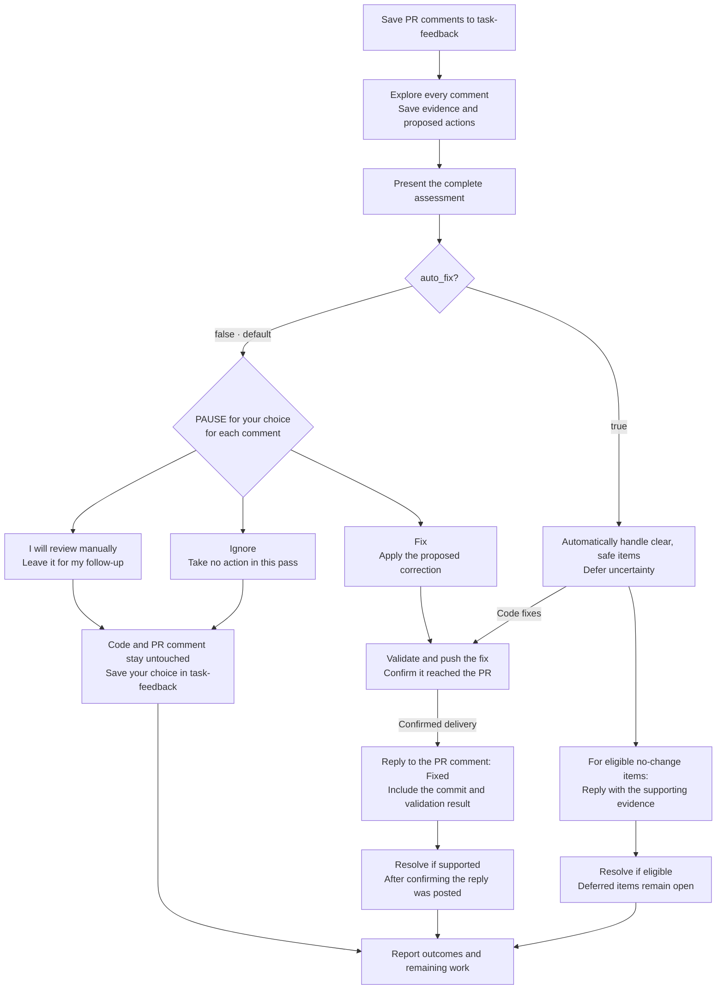
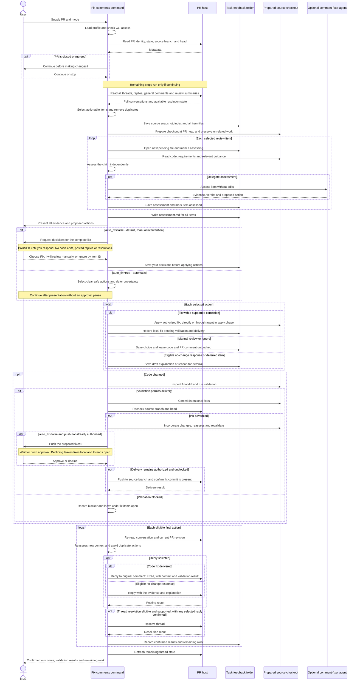

# Addressing PR review comments

## When to use this skill

Use this skill when a PR has review feedback to work through and you want an
evidence-based assessment of all comments before deciding which fixes to apply.

## Motivation

Addressing review feedback involves more than editing the cited lines. Developers
need to decide whether each concern is valid, account for overlapping requests,
validate the resulting changes, and communicate what was actually delivered.
That coordination repeats across PRs and is easy to leave incomplete.

As a skill, this workflow gives each comment a durable record of its evidence,
proposed action and outcome. Developers can make decisions after seeing the
whole assessment, then let the workflow carry selected fixes through validation,
delivery and a reply. It helps avoid blindly applying suggestions, losing manual
follow-up, or marking a comment fixed before the correction reaches the PR.

## Usage

Start with `/raholsn:fix-comments <PR URL or owner/repo#number>`.
Append `auto_fix=true` to let the command apply clear, safe fixes, push them,
and finalize eligible replies and resolutions without asking comment by comment.
With `auto_fix=false` (the default), the command investigates every comment,
presents all evidence and proposed actions, then **pauses for your decisions
before changing code**. For each item, choose **Fix**, **I will review manually**,
or **Ignore**. Pushing also requires approval unless already authorized.

## Workflow

### High-level overview

The diagrams describe the current
[`fix-comments` workflow](../claude-plugin/skills/fix-comments/fix-comments.md),
not a recorded execution. Each comment is evaluated independently against the
code and requirements before its proposed solution is accepted.



Deferred items stay open. A local edit is not a delivered fix: its thread stays
open if validation or delivery is blocked. No-change responses can be finalized
without a new commit when supported by current evidence and the selected action.
The **Fixed** reply is posted on the PR comment after the fix has been pushed
and confirmed in the PR. Thread resolution follows that reply where supported;
it is separate from the final summary shown to you.

### Detailed sequence

<details>
<summary>Detailed sequence: assessment, delivery and comment finalization</summary>



</details>

## Comment selection

The command reads all pages of review threads and their replies, general PR
comments, and review summary bodies. It includes actionable feedback regardless
of whether the reviewer is also the PR author. The configured `tool_signature`
identifies automated findings, including ones posted under your own account.

Resolved threads, duplicate findings, acknowledgements and status messages are
excluded. Outdated line references do not prove an issue was fixed: the command
checks current code and prior replies. General comments have no thread-resolution
state, so they are tracked as addressed or still open. If the host cannot expose
resolution state, it is reported as unknown.

## Assessment and saved feedback

### Capture the comments

Before assessing individual claims or editing code, the command writes the
selected comments into a task-feedback folder:

```text
task-feedback/
  source-comments.json
  index.md
  assessment.md
  001-<source-id>.md
  002-<source-id>.md
```

The index records the PR revision, fetch time, processing order and item status.
Each item keeps the original comment and replies alongside its assessment,
chosen action, code changes, validation needs and draft response. Original
reviewer text stays separate from the command's conclusions.

### Explore all comments

The command explores each file without changing code, recording the verdict,
concrete evidence, proposed action and needed validation. Unclear items get an
explicit limitation or open question. It saves all assessments before presenting
any per-item decisions to the user.

### Present the complete assessment

After every comment has been explored, `task-feedback/assessment.md` brings the
evidence and proposed actions together. The command presents the whole list,
including deferred and no-change items. In interactive mode you choose Fix,
I will review manually, or Ignore for each item (or several item IDs together).
Automatic mode also presents the assessment, then proceeds with clear, safe
actions without an extra approval pause.

Only then does it apply selected actions sequentially. Earlier fixes may satisfy
later comments; those items reference the same pending fix. Validation and
delivery can cover several fixes together, with results recorded in each file.

## Your decisions

### Interactive choices

With `auto_fix=false`, the complete assessment ends with these choices:

| Option | Outcome |
|---|---|
| **Fix** | Apply the supported proposed fix, validate it, and deliver it before replying and resolving the thread. |
| **I will review manually** | Leave the code and PR comment untouched; keep the item as your follow-up. |
| **Ignore** | Take no action in this pass and record the decision. The PR comment remains untouched. |

The choice is saved in the item's task-feedback file. Unanswered items remain
pending. If an item has no supported fix, selecting Fix needs clarification;
it does not cause an invented edit or automatic dismissal of the comment.

### How findings are handled

Assessment outcomes are handled as follows:

| Situation | Outcome |
|---|---|
| Valid concern with a safe local fix | Apply the authorized fix and draft a reply. Finalize after validation and delivery. |
| Invalid or already-addressed concern | Save the evidence from current code. Post an explanation only in automatic mode or when explicitly requested; no new commit is necessary. |
| Partially valid concern | Separate the supported defect from unsupported claims and choose a focused action. |
| Ambiguous, conflicting, risky or product-dependent concern | Leave it open and explain what remains undecided. |
| Ignored or manual-review item | Make no code change, reply or resolution on the user's behalf. |

## Responsibilities

### Standalone command and agent

The standalone command owns user decisions, validation, commits, pushes, replies
and resolution. It can do local analysis and editing itself or delegate those
parts to the [`comment-fixer` agent](../claude-plugin/agents/comment-fixer.md).
The agent first runs in assessment mode; a later apply call performs selected
edits after the complete assessment has been presented. It records results and
draft replies in the item files and does not publish them.

### Post-push workflow

Inside the `work` workflow,
[`ref-post-push-review`](../claude-plugin/skills/ref-post-push-review/SKILL.md)
owns those delivery and host actions instead. Its fix pass selects this tool's
findings by signature; other reviewers' items require an explicitly supplied
scope. It uses the same agent for local assessment and edits.

## Validation and delivery

### Prepare the checkout

The command verifies the source repository and PR head, including fork branches.
It reuses a clean checkout at that commit or prepares an isolated worktree while
preserving unrelated changes and local commits.

### Validate and push

Code fixes are validated before delivery. Missing or skipped validation is
reported explicitly; proceeding with that limitation requires the user's
acceptance. If the PR advances, the command incorporates the new work and
revalidates rather than overwriting it. Failed or declined pushes leave fixes
pending delivery and their threads open.

## Replies and thread resolution

A completion reply references the delivered fix commit and validation result.
Resolution is recorded only after the host confirms it. Unsupported resolution
and failed host actions remain visible as follow-up work; general comments are
never described as resolved threads.

## Results and saved files

Each invocation saves its working files under
`<roots.artifacts>/fix-comments-<repo>-<pr-number>/run-<unique-id>`.
Its `task-feedback` folder holds the index and item files used throughout the
workflow, including each item's evidence, action, validation and confirmed host
status. The post-push workflow creates a fresh task-feedback folder for each pass.

The final report distinguishes delivered fixes, local fixes pending delivery,
no-change dispositions, posted replies, resolved threads, and manual-review,
ignored or deferred items. Remaining general comments and unknown thread state
are reported separately. Making no code changes does not mean every comment was addressed.
