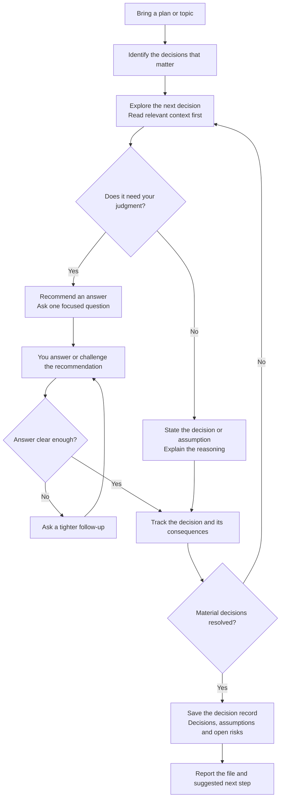
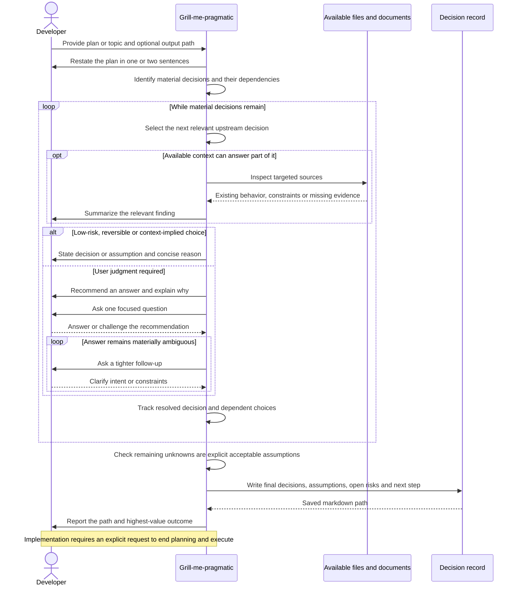

# Clarifying a plan with grill-me-pragmatic

## When to use this skill

Use this skill when you have a plan or idea that needs to be challenged and
clarified before implementation. It suits discussions where unresolved scope,
behavior, dependencies or tradeoffs could change what should be built.

## Motivation

A planning conversation should uncover decisions that matter without requiring
the developer to decide every detail. Taken too strictly, questioning a plan can
turn into hundreds of questions, including choices that are conventional,
easy to reverse or already implied by the codebase. That adds work without
necessarily improving the plan.

The pragmatic part is accepting that the AI can make some decisions on its own.
It can follow established patterns, choose reasonable defaults and make low-risk
assumptions, stating those choices briefly so they remain visible and open to
correction. They do not all need a question and explicit approval.

The developer's attention is reserved for choices that materially affect scope,
user behavior, risk or costly commitments. The aim is to challenge the plan
enough to expose important gaps while keeping the conversation useful and moving
forward. The resulting decision record captures the choices and assumptions
for the next step.

## Usage

Start with `/raholsn:grill-me-pragmatic <plan or topic>`.
Provide the outcome you have in mind and any relevant context, such as a plan,
design document or repository. You can also specify where to save the decision
record.

This is a standalone planning conversation. It does not require a particular
company profile, tracker or delivery workflow. Implementation begins only if you
explicitly end the grilling phase and ask for execution.

## Workflow

### High-level overview

The diagrams describe the current
[`grill-me-pragmatic` skill](../claude-plugin/skills/grill-me-pragmatic/grill-me-pragmatic.md),
not a recorded execution.

Only relevant decisions enter this loop. The skill skips questions that would
not materially change the plan, and resolves upstream choices before dependent
ones. Completion allows explicit, acceptable assumptions; it does not require
eliminating every unknown.

### Detailed sequence

Expand the planning conversation and decision-record sequence

## Exploration and questions

### What it explores first

The skill reads available guidance, specifications, notes and relevant code before
asking about discoverable facts. For code plans, that can include entry points,
tests, configuration, migrations, clients and dependencies. Exploration stays
focused on the current decision rather than becoming a complete repository audit.

### When it asks you

| Situation | Approach |
|---|---|
| Existing code or documents establish the answer | Inspect the source and explain the finding. |
| A choice is low-risk, reversible or implied by context | Make the decision, state the assumption and explain why. |
| Scope, user behavior, success criteria or a consequential tradeoff needs judgment | Recommend an answer and ask one focused question. |
| Your answer leaves material ambiguity | Ask a tighter follow-up. |
| The answer would not materially change the plan | Skip the question. |

The recommendation is a proposal for you to assess. You can reject it, explain
a constraint or change the direction. The skill tracks resolved decisions rather
than repeatedly asking you to confirm them.

### What it challenges

Relevant topics include goals and non-goals, user journeys and contracts, data
and migrations, failure handling, permissions, rollout, operability, testing and
delivery dependencies. These are areas to consider, not a checklist of mandatory
questions. Terms such as “simple,” “later” or “temporary” are challenged when
their meaning affects an actual decision.

## Responsibilities

The skill investigates available facts, challenges material uncertainty,
recommends options and maintains the decision record. The developer supplies
intent and makes the choices that depend on product priorities, acceptable risk
or stakeholder needs.

During the conversation, the skill reads context and clarifies the plan. It does
not implement the proposed change. Its output is a planning record, not a claim
that the implementation has been built or validated.

## Completion and saved files

### When the conversation ends

The conversation finishes when the relevant decisions are concrete enough to
move forward and the remaining unknowns are explicit, acceptable assumptions.
It should not continue merely because more detail could be discussed.

### Decision record

The final markdown contains:

- **Plan Summary:** the intended outcome.
- **Decisions:** the choices made and their reasoning.
- **Assumptions:** what is being assumed and why it is acceptable.
- **Open Risks or Questions:** material unresolved items.
- **Suggested Next Step:** the recommended action after planning.

It records the outcome rather than the full interview transcript. The final
response links the file and summarizes the most important result.

### File location

An explicitly requested output path takes precedence. Otherwise the skill uses
an existing planning directory, such as `docs/planning/`, `docs/prds/` or
`planning/`. If none exists, it creates `docs/planning/` under the current working
directory.

The default filename is `YYYY-MM-DD-<short-plan-slug>-grill-decisions.md`.
Existing files are not silently overwritten. Inline-only output is available
when requested, or when writing a file is unavailable.

## Next steps

You can use the record directly when continuing the work, or pass it to
`/raholsn:write-requirements` to turn the clarified plan into a PRD. The skill recommends a
next step but does not automatically start implementation or another workflow.
