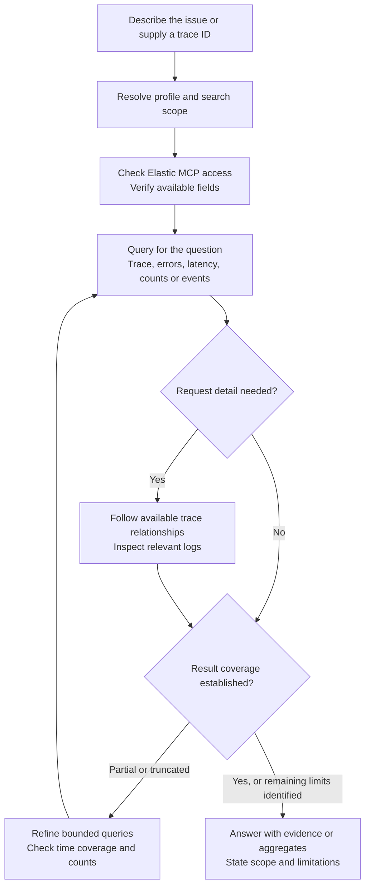
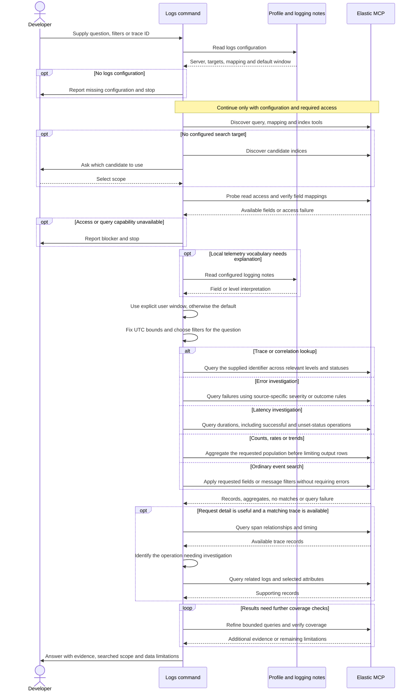

# Investigating logs and traces

## When to use this skill

Use this skill when investigating a failed request, a slow operation or unexpected
behavior in a deployed service. You can start with a trace or correlation ID, or
describe what you want to find in a particular environment and time window.

## Motivation

A useful diagnosis often requires connecting events across services. An isolated
error message can describe a downstream symptom while the relevant failure or
delay happened earlier. Finding that sequence means locating the right telemetry,
following request relationships and separating useful evidence from large payloads.

The motivation for this skill is to make that investigation faster and more
consistent. It gives the AI a method for querying the configured store, tracing
the available request path and presenting the records that support its answer.
The developer gets evidence to investigate further, with the search scope and
missing data made visible, rather than having to judge an unexplained diagnosis.

## Usage

Start with `/raholsn:logs <question or trace ID>`.

Examples:

```text
/raholsn:logs Trace <correlation-id> in staging during the last hour
/raholsn:logs Find payment-service errors in production between 09:00 and 09:15 UTC
/raholsn:logs Find the slowest checkout requests in staging during the last hour
/raholsn:logs Count payment-service errors per minute in production during the last hour
```

Include the environment, service and time window when known. The profile supplies
configured streams or indices, field mappings and a default time window. A missing
target may require your input; the command should not silently search every
accessible index.

## Workflow

### High-level overview

These diagrams describe the current
[`logs` skill](../claude-plugin/skills/logs/logs.md).
They are not a recorded investigation.



Connection or permission failures are reported as blockers, not as empty search
results. A partial response is not treated as a complete trace.

### Detailed sequence

<details>
<summary>Expand connection checks, trace exploration and reporting</summary>



</details>

## Configuration and access

### Profile

The `logs` block selects the MCP server, telemetry targets and mapping shape:
OpenTelemetry, ECS or custom. ECS and custom stores can provide source-level
severity mappings; custom stores can also map fields and span kinds. A configured
logging-notes document supplies local terminology.
Actual index mappings must be checked before constructing queries.

### Elastic MCP

The bundled connection uses Elastic Agent Builder through MCP. Connection
details and credentials belong to the MCP configuration, while search targets
and field mappings belong to the profile. See the
[Elastic MCP setup instructions](../README.md#elastic-mcp-setup).

The command discovers the actual exposed tool names and schemas. It uses
read-only query and discovery tools, and does not fall back to shell queries
when the connection is unavailable. It does not restart services, modify data
or run remediation workflows.

## Investigation method

### Establish scope

Choose the environment or target stream, time window and relevant filters.
An explicit user window takes precedence over the configured default. Relative
windows are resolved once into UTC bounds so repeated queries use the same scope.
Trace follow-up may need a wider window for asynchronous work, but that extra
scope is labeled separately and does not change requested totals.

### Choose a query for the question

| Question | Approach |
|---|---|
| What happened to this request? | Search its trace or correlation ID, then follow available relationships. |
| Which requests failed? | Use failure predicates that match the source's severity or outcome semantics. |
| Which operations were slow? | Query durations with verified units, including successful operations and unset span statuses. |
| How many events occurred, or how did the rate change? | Aggregate the full matching population before limiting output rows. Define the counted event and rate denominator. |
| Did a particular event occur? | Search the requested fields or message text without imposing an error filter. |

Counts and ordinary searches do not require a trace. A request without span
relationships can still be investigated as a bounded log timeline, with the
missing call structure reported as a limitation.

### Interpret severity and status

The OpenTelemetry numeric error threshold applies only to fields using that
scale. ECS `event.severity` is source-defined, so the skill uses documented
numeric semantics or source-level error/fatal values instead. Unknown severity
semantics remain a limitation rather than becoming a guessed filter. See the
[ECS severity definition](https://www.elastic.co/docs/reference/ecs/ecs-event#field-event-severity).

An `Unset` span status is the default, not proof of successful execution. The
skill checks logs, response codes, timing and other outcome evidence before
drawing a conclusion. Explicit `Error` status identifies error-marked spans;
“not Ok” is not an error filter. See the
[OpenTelemetry status specification](https://opentelemetry.io/docs/specs/otel/trace/api/#set-status).

### Trace before reading large payloads

For a request investigation, the skill first uses span relationships to outline
the call path and timing, then reads logs for the operation that matters. Custom
stores may instead carry parent relationships in log records; the profile
describes that arrangement.

The skill focuses on fields that support the question rather than dumping full
payloads. Missing or truncated fields limit what the answer can establish.

### Check result coverage

Queries are bounded and limited. When a limit is reached or the tool truncates
its response, the skill narrows or splits the search and uses counts to assess
coverage. Zero matches apply only to the searched scope; they do not establish
that the event never occurred. Failed queries are reported separately.

## Results

The answer identifies the searched stream and time window and shows the smallest
set of records needed to support it. Large payloads are summarized through the
relevant fields. Missing data, truncation and access failures remain visible.

Unlike the planning and review skills, the current `logs` skill does not require
a saved markdown report or define an output folder. Its default result is an
answer in the conversation.
