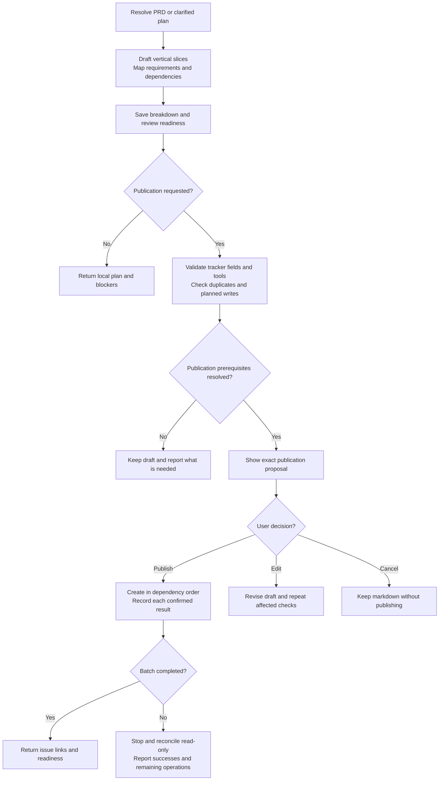
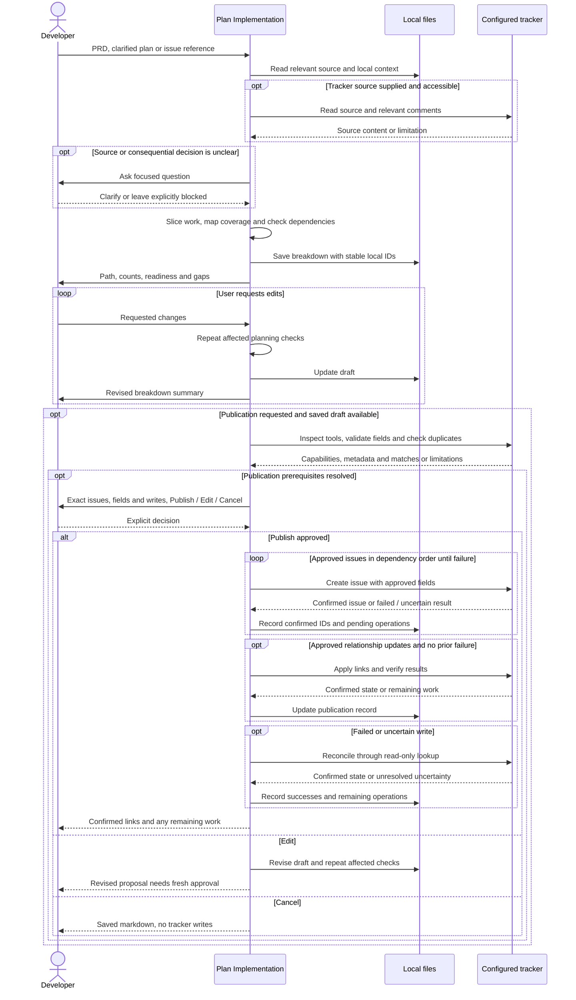

# Planning implementation with plan-implementation

## When to use this skill

Use `/raholsn:plan-implementation` during planning, usually after
[`grill-me-pragmatic`](grill-me-pragmatic.md) has clarified the decisions and
[`write-requirements`](write-requirements.md) has captured the requirements. It turns the PRD or clarified
plan into a local issue breakdown. Later, [`work`](work.md) can implement a
selected ready issue when requested.

## Motivation

A PRD describes the intended outcome. Implementation issues need smaller scope,
observable acceptance criteria and an order that respects dependencies. This
skill divides the work into thin vertical slices, checks requirement coverage
and keeps unresolved decisions visible. The saved plan can be reviewed before
any tracker items are created.

## Usage

```text
/raholsn:plan-implementation docs/prds/2026-09-14-payment-retries-prd.md
/raholsn:plan-implementation Break the clarified plan above into implementation issues
/raholsn:plan-implementation PLAN-123
```

You can specify an output path or request publication as part of the invocation.
Publication still requires approval of the completed breakdown and exact tracker
operations. This command has no `--auto` mode.

If the intended source is ambiguous, the skill asks which document to use. It
does not choose solely by modification date or invent unavailable source content.
A blocked PRD can produce a provisional breakdown with decision tasks, with its
blocked status preserved.

## Workflow

### High-level overview

These diagrams describe the instructions in the
[`plan-implementation` skill](../claude-plugin/skills/plan-implementation/plan-implementation.md), not a recorded execution.



### Detailed sequence

<details>
<summary>Expand planning, approval and partial publication recovery</summary>



</details>

## Planning decisions

| Concept | Meaning |
|---|---|
| Vertical slice | A narrow end-to-end behavior that can be demonstrated, tested or operationally verified. |
| AFK | Implementation decisions and acceptance criteria are sufficient without further human clarification, once prerequisites are satisfied. |
| HITL | Human input or an external decision is required, with the question and expected decision artifact identified. |
| Ready | The issue's prerequisites are satisfied for its stated activity. |
| Blocked | A named dependency or unresolved decision prevents that activity from starting. |

AFK/HITL is separate from readiness. An AFK implementation issue can still be
blocked by another issue. A HITL decision task can be ready for human action.
Neither classification grants permission to start implementation.

Every in-scope requirement and acceptance criterion maps to stable local issue
IDs, such as `I-01`. Proposed omissions remain visible and prevent calling the
plan complete until resolved. Dependencies must be acyclic and explain why work
is blocked. Creating a blocker ticket does not satisfy the blocker.

## Your publication decision

| Choice | Result |
|---|---|
| **Publish** | Approve the displayed issue bodies, target, fields and required link or update operations. |
| **Edit** | Revise the breakdown and repeat affected checks before fresh approval. |
| **Cancel** | Keep the markdown and stop without tracker writes. |

Approval of the plan alone does not authorize publication. Silence and ambiguous
replies do not count. A publication request begins preparation, followed by review
of the concrete proposal. An explicitly approved backlog may contain blocked
planning issues, but must accurately show their readiness.

## Configuration and output

Local planning needs no company profile or tracker. Reading a tracker source or
publishing uses the [company profile](profile.md) and its `tracker` connection and
defaults. Explicit user fields override defaults. The skill validates the actual
team, status and optional fields, and shows them before publication. It does not
assume planning issues should start in the working status used by `work`.

The output uses your requested path, an existing issue-planning directory or
`docs/issues/`, with the default name
`YYYY-MM-DD-<short-plan-slug>-issues.md`. Existing files are preserved with a
numeric suffix unless revision was requested. The original PRD and parent issue
are preserved unless you separately authorize changes.

The breakdown contains source provenance, scope, coverage, issue bodies,
AFK/HITL classification, readiness, dependencies and a publication record. A local
PRD path is provenance, so published bodies must contain enough context to stand
on their own.

## Responsibilities

| Participant | Responsibility |
|---|---|
| Developer | Identify the plan, resolve material decisions, review the breakdown and explicitly approve publication. |
| Skill | Preserve scope, draft actionable slices, check coverage and dependencies, save the plan and verify authorized writes. |
| Company profile | Supply tracker connection and company defaults when needed. |
| Tracker | Expose supported operations, metadata and confirmed issue state. |

## Results and failure recovery

A local run returns the saved path, issue counts, readiness, coverage gaps and
major dependency chain. Missing tracker configuration is a normal local-only
outcome. If saving is unavailable, the draft is returned inline and publication
waits until a local record can be saved.

Publishing checks for duplicates and creates issues in dependency order. It
records each confirmed tracker ID and URL against the local issue ID. Native
blocker links are used only when supported and approved. Otherwise the proposal
can use explicit blocker references in issue bodies and disclose that limitation.

A failed or uncertain write stops the batch. Read-only reconciliation identifies
what exists before any retry is considered. Successful issues are retained, and
remaining operations require fresh approval. The skill never blindly recreates
an issue or deletes successful items to imitate a rollback.
