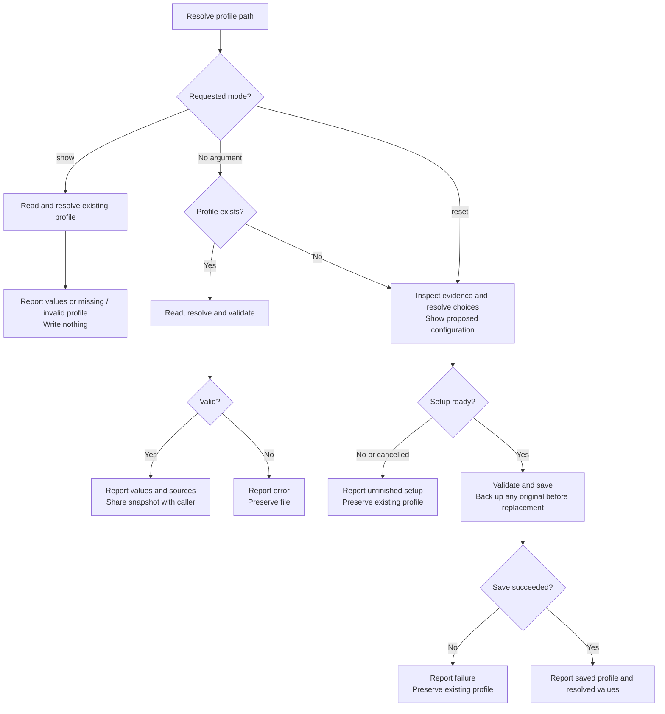
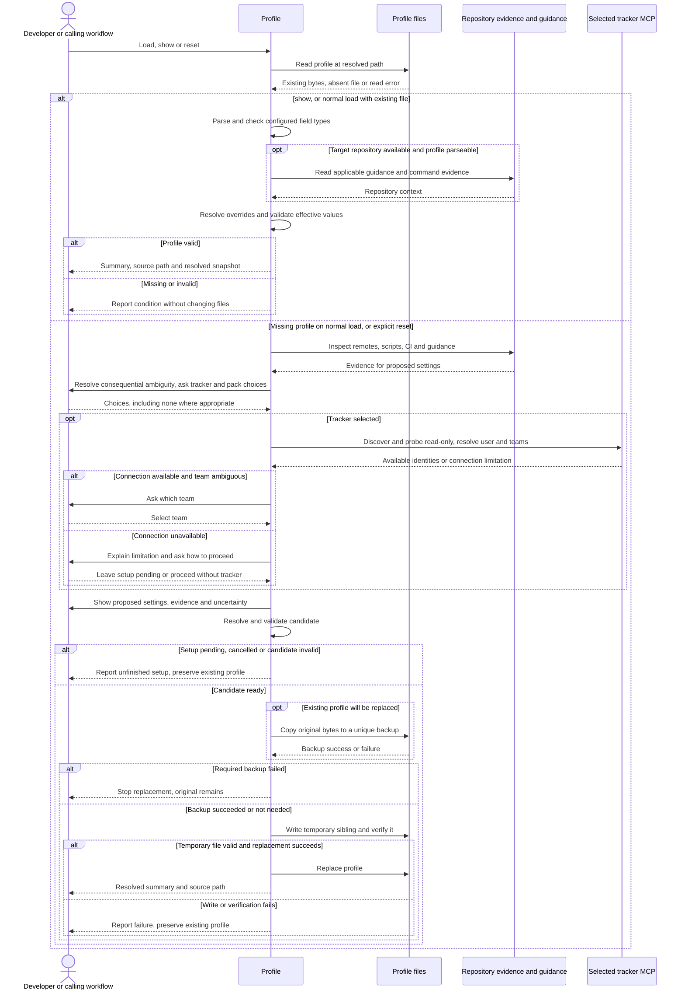

# Configuring workflows with profile

## When to use this skill

Use `/raholsn:profile` to configure the skills with your company's context:
where repositories live, which tracker you use, how to build and test, and where
to find company guidance. Use it again to inspect or reset that configuration.
Workflows also call it to resolve their configuration before dependent steps begin.

## Motivation

The skills need your company's context to do useful work: which repositories
and tools to use, how changes are validated, and which conventions apply.
The profile supplies those settings and points to company knowledge in an
optional pack, while repository guidance provides details specific to each repo.

Shared defaults avoid repeating the same configuration across skills.
Repository overrides keep an application's build commands and branch settings
scoped to that application. The resolved summary shows which values a workflow
will use and what still needs configuring.

## Usage

| Command | Result |
|---|---|
| `/raholsn:profile` | Load an existing profile, or help create one when absent. |
| `/raholsn:profile show` | Show resolved values and the file path without writing or starting setup. |
| `/raholsn:profile reset` | Prepare a fresh profile and back up the original before replacing it. |

The profile lives at `$CLAUDE_PLUGIN_DATA/profile.json`. If that variable does
not resolve, the skill uses `~/.raholsn/profile.json` and reports the fallback.
An unknown argument produces usage information without changing files.

## Workflow

### High-level overview

These diagrams describe the instructions in the
[`profile` skill](../claude-plugin/skills/profile/profile.md), not a recorded execution.



### Detailed sequence

<details>
<summary>Expand loading, setup and replacement details</summary>



</details>

## Setup and developer decisions

The skill reads repository evidence before asking for discoverable values. It
uses the intended remote's default branch, with a read-only host lookup when
needed, and asks if that branch cannot be established. A current feature branch
is not used as a substitute. Forks and ambiguous remotes require identifying
the intended target.

Build commands come from guidance, CI, scripts and runner configuration. A
project marker alone does not establish the package manager, build script or
test-filter syntax. Unsupported commands remain null. Detection does not run
builds or tests.

You choose a tracker and optional pack, and resolve consequential ambiguity such
as the team or intended workspace. Tracker discovery uses read-only MCP calls to
find available teams and the current user. If the connection is unavailable,
you can leave setup pending or proceed without it. Selecting a profile value
does not install or authenticate an MCP server.

### New-profile defaults

| Setting | Default |
|---|---|
| Profile label (`assignment`) | `day-one` |
| Artifact root | `~/.raholsn-work` |
| Draft PRs | `true` |
| Branch and PR title templates | `{description}` |
| Commit title template | `{title}` |
| Tool signature | `raholsn` |
| Unconfirmed build commands and filter | null |
| Optional integrations, pack, knowledge, services, compliance and hooks | Omitted unless configured |

Repository and VCS settings are established from evidence or your input.
`AGENTS.md` is selected when present, otherwise `CLAUDE.md` when present;
without either, the guidance-file setting is null.

## Configuration precedence and lifetime

Later sources override earlier ones:

1. Shared company defaults in the profile.
2. The matching `repo_overrides` entry.
3. Explicit settings in applicable repository guidance.
4. Explicit instructions for the current invocation.

Override objects merge by field. Arrays and scalar values replace earlier
values; null disables an optional field. Required values must still be valid.
The effective snapshot changes without rewriting the saved profile.

For example, this fragment scopes commands to one repository:

```json
{
  "repo_overrides": {
    "/home/developer/dev/web-app": {
      "build": {
        "build_cmd": "npm run build",
        "test_cmd": "npm test"
      },
      "vcs": { "base_branch": "main" }
    }
  }
}
```

This is a configuration fragment, not a complete profile. Bootstrap saves
detected build settings under the matching repository override. Existing
shared `build` values remain supported, but their applicability is
checked against the repository before execution.

Each workflow invocation reads the profile afresh and shares its resolved
snapshot with downstream steps and agents. A profile edit, reset or repository
change requires fresh resolution. Without a target repository, only shared company
defaults are resolved; `show` reports that repository overrides were not applied
and does not ask you to select a repository.

### Path resolution

| Path | Resolution |
|---|---|
| `~` | Your home directory |
| Relative `roots.*` and `pack` | Profile directory |
| `guidance_file` | Target repository root |
| `repo_overrides` keys | Absolute or home-relative repository roots, normalized before matching |
| Relative `knowledge.*` and `post_merge_hooks` | Pack directory |
| `repo_roles.*` | `roots.repos` |
| Relative RabbitMQ auth-file paths | Profile directory |
| Relative RabbitMQ notes | Pack directory |

Duplicate override keys after normalization are rejected. Loading or showing a
profile does not create artifact directories; workflows create them when needed.

## Validation and missing configuration

The profile must be a JSON object with correctly typed known fields.
`roots.artifacts` and `vcs.base_branch` must resolve to nonempty strings.
Malformed JSON and invalid configured values are reported with the file path,
parser details or affected dotted keys. They do not trigger an automatic reset.
Unknown fields are preserved; consumers validate their additional service-specific
requirements.

| Situation | Outcome |
|---|---|
| No tracker during general development | Continue ticketless and skip tracker actions. |
| No tracker for ticket creation | Report the missing prerequisite before creating a ticket. |
| No build command | Record the configured validation gate as skipped, not passed. |
| No configured compliance reviewers | Skip those reviewers. |
| No pack | Skip pack lookups; repository guidance still applies. |
| No logs, SQL or RabbitMQ configuration for a query request | Explain what is missing before querying. |
| Configured dependency is invalid or inaccessible | Report the limitation; the caller decides whether its requested outcome remains possible. |

## Responsibilities and connection details

The skill owns configuration discovery, resolution, validation and profile-file
handling. The developer supplies intent where evidence cannot establish it.
Calling workflows receive the full resolved object, validate prerequisites for
their action and report skipped steps accurately.

The resolved summary does not print credentials. For Elasticsearch, `logs.mcp`
defaults to `elastic`; connection URL and authentication are supplied separately
through `ELASTIC_MCP_URL` and `ELASTIC_MCP_API_KEY`. Legacy `logs.endpoint` and
`logs.auth` are not consumed by the logs skill. See the
[Elastic MCP setup](../README.md#elastic-mcp-setup) for connection instructions.

### RabbitMQ settings

The profile recognizes the optional `rabbitmq` block and validates its environment
map, default selection and connection field shapes using the
[RabbitMQ configuration contract](../claude-plugin/skills/rabbitmq/references/management-api.md).
The resolved summary includes environment names and the default. Missing defaults
mean the RabbitMQ command asks which environment to use.

The [company example](../profiles/company.example.json) includes sandbox/production
RabbitMQ templates. These use replacement values, not verified live connections.
Replace example.com hosts and `REPLACE_WITH_*` fields, confirm the vhost and
provision each auth file before use.

On requested RabbitMQ setup, the profile collects these values without running
an investigation. Load/show does not read credentials, log in, start tunnels or
query a broker. Placeholder connections are reported as unconfigured for
RabbitMQ; unrelated workflows can still use an otherwise valid profile.

## Results and saved files

A successful load prints the profile label, profile path, roots, VCS, tracker, logs, RabbitMQ environments,
build and test commands, pack, guidance file and tool signature, followed by
applicable repository and override sources. Missing scalar values appear as
`unset`; absent optional blocks appear as `none`.

Loading and `show` do not modify files. Initial setup writes `profile.json`.
Reset copies the original bytes to `profile.json.bak`, or a unique timestamped
backup if that name already exists. It verifies a temporary sibling file before
replacement. Backup, validation or write failure leaves the existing profile
intact. No separate Markdown report is required.

If you name a legacy configuration file while the profile is absent, the skill
can prefill matching tracker values. It asks you to confirm each migrated value
is current before writing and keeps the legacy file.

The [company example](../profiles/company.example.json) illustrates a populated
configuration. Successful profile loading establishes configuration; it does
not mean that builds, tests or downstream workflow actions have run.

## Configuring company guidance

Edit `ref-company-conventions` and `ref-company-testing` directly for the current
company. Their shared names stay stable across assignments. A pack is optional;
`knowledge.conventions` and `knowledge.testing` are only needed when selecting
external documents instead of the directly configured reference sections.
