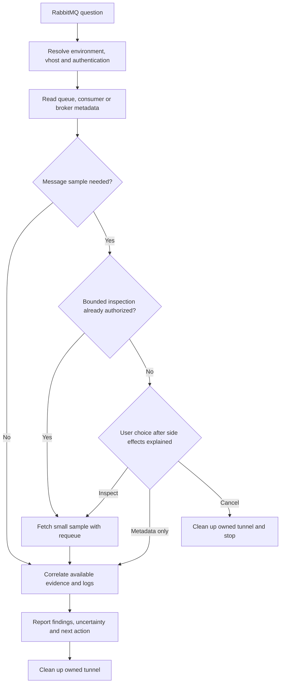
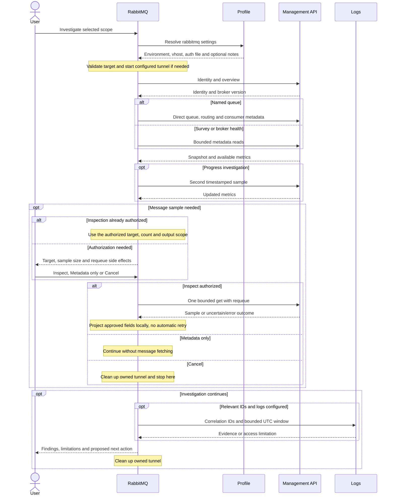

# RabbitMQ

## When to use it

Use `/raholsn:rabbitmq` to investigate queue backlogs, dead-letter messages,
missing consumers or broker health. It surveys queue metadata, examines selected
queues and can correlate evidence with the configured logs workflow.

## Motivation

A growing queue does not explain whether consumers are absent, processing slowly,
or repeatedly failing. This workflow brings queue state, routing, consumer
activity and application evidence together so the next action follows from what
was observed. It preserves the evidence needed to assess a recovery decision.

## Usage

```text
/raholsn:rabbitmq sandbox list queues with a backlog
/raholsn:rabbitmq production investigate the orders.dead queue
/raholsn:rabbitmq sandbox why has the orders consumer stopped making progress?
/raholsn:rabbitmq sandbox check broker health
```

The command supports explicit invocation and natural-language selection for
RabbitMQ requests. A configured default environment can be used; otherwise it
asks which environment to inspect. An exact queue request goes directly to that
queue, while a survey uses bounded pagination.

## Workflow



<details>
<summary>Detailed sequence</summary>



</details>

## Configuration and responsibilities

Add a `rabbitmq` block to your profile using the
[configuration example and connection contract](../claude-plugin/skills/rabbitmq/references/management-api.md).
A ready-to-edit full profile is available in
[profiles/company.example.json](../profiles/company.example.json), including
sandbox/production templates. These need real connection
values and provisioned auth files before use. The profile loader validates their
shape and reports placeholders without contacting the broker.
The block supplies environments, management URLs, vhosts and a protected auth-file path.
Optional pack notes supply login procedures, correlation-header conventions and
recovery knowledge; optional tunnel settings supply Kubernetes connection values.
The shared profile design remains unchanged.

The skill uses curl and jq. Basic and OAuth HTTP authentication use a locally
provisioned, owner-only auth file; credentials never belong in the profile.
Your company supplies any OAuth helper/device-login setup. Kubernetes is needed
only for a configured port-forward; Elastic MCP is needed only for log correlation.
There is no new bundled MCP server or custom broker client.

| Responsibility | Owner |
|---|---|
| Endpoints, identities, access and queue conventions | Company configuration |
| Metadata collection and evidence-based diagnosis | RabbitMQ skill |
| Application trace searches | Existing logs skill, when configured |
| Permission for message inspection with requeue | User, within the current request |
| Recovery decision and execution | Separate operational workflow |

## Decisions and limits

Metadata reads proceed within the requested scope. Message fetching is a distinct
operation: requeue does not make it passive or guarantee unchanged delivery state.
The skill explains the effects and requests a decision when authorization is
missing. Inspection defaults to five messages with payloads truncated to 4096
bytes; displayed fields are bounded separately. It does not automatically retry
an uncertain fetch. These semantics follow the
[RabbitMQ HTTP API](https://www.rabbitmq.com/docs/http-api-reference).

Surveys are not atomic. Missing metrics remain unknown; a successful management
request does not establish application health. Broker death headers describe
broker outcomes, while application causality requires supporting evidence.
Delivery-limit behavior depends on broker version and policy; see
[quorum queue handling](https://www.rabbitmq.com/docs/quorum-queues).

Replay needs evidence about prior side effects, idempotency, current state and
destination. Purge requires a supported retention/recovery decision. This skill
proposes next steps but does not replay, purge, drain, publish, change policies or
restart services.

## Results and saved files

The default result is a conversational summary with target, UTC observation times,
queue/consumer findings, sample scope if used, correlated evidence and remaining
uncertainty. A redacted report is saved only when requested. Authentication files
are external prerequisites, not report artifacts. Only tunnels started by this
invocation are cleaned up.

Local manifest, frontmatter, link and diagram checks validate packaging and
documentation. They do not establish live authentication, broker access or
end-to-end Claude invocation behavior.

Source: [RabbitMQ skill](../claude-plugin/skills/rabbitmq/rabbitmq.md).
