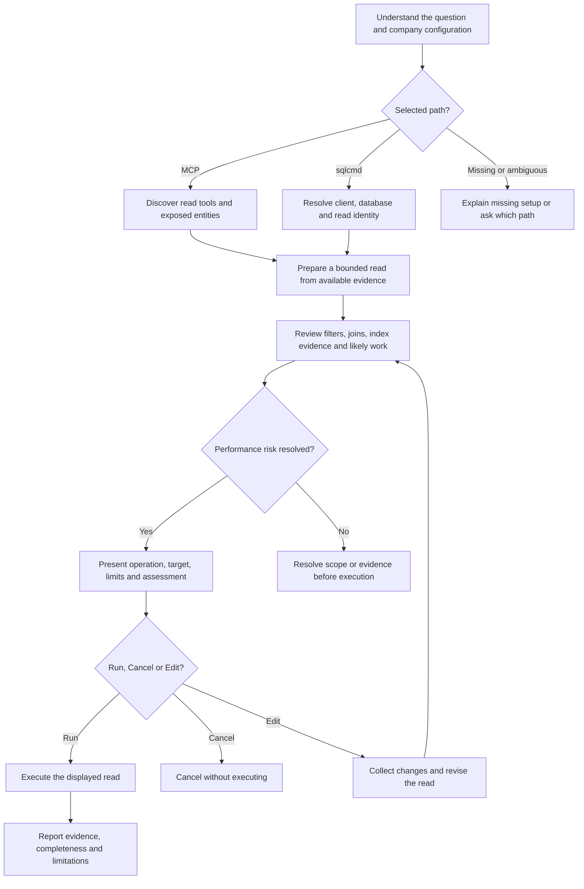
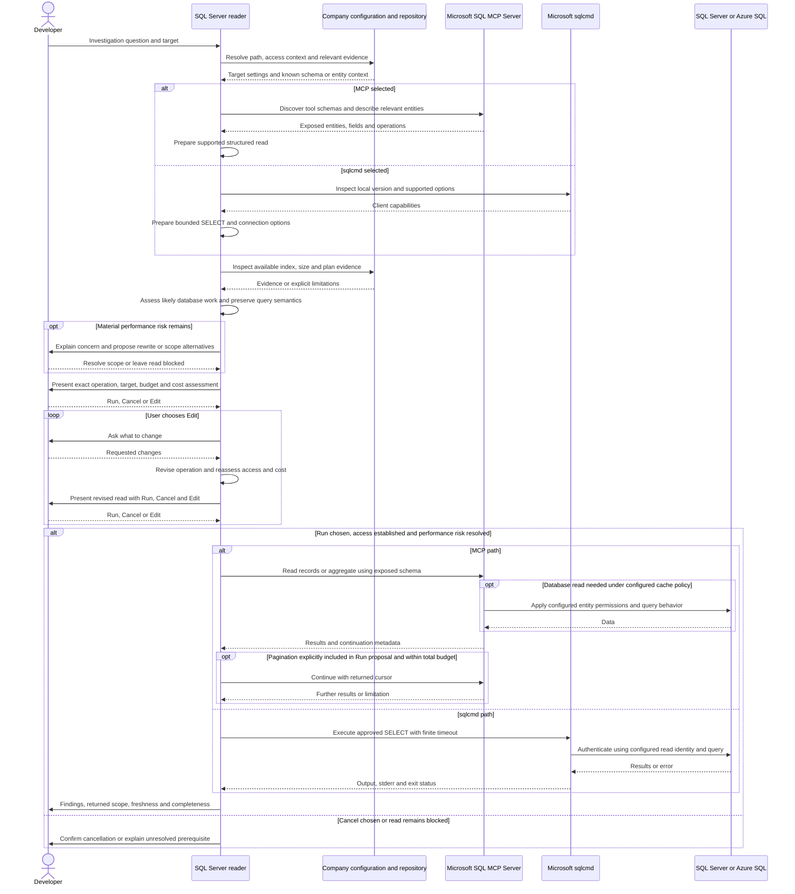

# Investigating data with sql-server-reader

## When to use this skill

Use `/raholsn:sql-server-reader` to look up records, check database state or
investigate a data issue in SQL Server or Azure SQL Database. It supports
Microsoft SQL MCP Server and a Microsoft sqlcmd path for environments without
MCP. Company configuration supplies the targets, access and database context.

## Motivation

An investigation needs the right data and a clear explanation of what it proves.
This skill connects the question to repository or entity knowledge, prepares a
bounded read, and distinguishes complete evidence from samples or stale results.

Companies can provide an MCP interface over selected entities or direct read
access through sqlcmd. The skill works with those arrangements using Microsoft's
tools, without maintaining a separate database client inside the plugin.

## Usage

```text
/raholsn:sql-server-reader Look up the current status of record <id> in <target>
/raholsn:sql-server-reader Count records in <target> between <start> and <end>
/raholsn:sql-server-reader Run this SELECT against <server/database>: <SQL>
```

Supply the target and identifiers you know. For time-based questions, include
the timezone when relevant. The skill reads available context before asking for
missing details. Before execution, it shows the prepared read and asks you to
choose **Run**, **Cancel** or **Edit**, including when you supplied the SQL yourself.

## Workflow

### High-level overview

These diagrams describe the
[skill instructions](../claude-plugin/skills/sql-server-reader/sql-server-reader.md),
not a recorded database investigation.



A failed connection or unsupported query is reported. Switching from MCP to
direct SQL requires a configured target and explicit authorization for that
scope; it is not an automatic recovery step.

### Detailed sequence

<details>
<summary>Expand the two read paths</summary>



</details>

## Your execution decision

**Every query requires your explicit approval before execution**, including
permission, catalog and estimated-plan queries, on both MCP and sqlcmd paths.
The skill must wait for you to choose **Run** or explicitly approve the displayed
proposal in equivalent words. A general investigation request, read-only access
or a low-risk assessment does not authorize execution.

The final preview includes the target and environment, SQL or structured MCP
arguments, limits and the query-cost assessment.

| Choice | What happens |
|---|---|
| **Run** | Execute the displayed read once its access and performance requirements are satisfied. |
| **Cancel** | Stop this proposed read without executing a replacement. |
| **Edit** | Revise the read, repeat relevant checks, and present the three choices again. |

No reply or an ambiguous reply leaves the read pending; a preselected Run option
does not count as approval. Supplying SQL initially does not skip this
review. Once you choose Run for the displayed proposal, there is no second
confirmation. A retry, changed target or changed query needs another review.

A bounded MCP read may include pagination when the preview explicitly states
that and the total budget. Other queries and unplanned pages need their own
Run decision. Permission, catalog and estimated-plan queries use the same gate;
local files and non-query MCP descriptions can be inspected during preparation.

## Choosing and configuring a path

| | Microsoft SQL MCP Server | Microsoft sqlcmd |
|---|---|---|
| Best fit | Company exposes selected entities through MCP | Company provides direct read access without MCP |
| Input | Structured entity operations | Approved SELECT statements |
| Discovery | Exposed tool schemas and entity descriptions | Repository evidence and approved catalog queries |
| Boundaries | Configured entity/role permissions and database access | Database permissions and the approved SQL scope |
| Limitations to report | Available operations, pagination, caching and entity visibility | Query bounds, text formatting, output truncation and execution errors |

### MCP example

This is a profile fragment:

```json
{
  "sql": {
    "backend": "mcp",
    "mcp": "sql-server",
    "target": "Reporting database",
    "environment": "stage",
    "default_row_limit": 20
  }
}
```

The optional bundled HTTP connection reads `SQL_MCP_URL`. Configure authentication
in the MCP client/server. For an existing named connection or a local stdio
server, use that connection's name instead. The skill does not deploy Microsoft
SQL MCP Server or decide which company entities to expose.

### sqlcmd example

This is an Entra-authenticated profile fragment; other supported authentication
can be supplied through company configuration:

```json
{
  "sql": {
    "backend": "sqlcmd",
    "servers": { "stage": "<configured-server>" },
    "default_server": "stage",
    "authentication": "ActiveDirectoryDefault",
    "default_timeout": 30,
    "default_row_limit": 20
  }
}
```

The database is resolved for the requested read. The skill checks the installed
sqlcmd variant before selecting authentication and encryption options. It does
not require the former .NET runner or assume every company uses Azure CLI login.

If `backend` is omitted, an MCP connection selects MCP; a server mapping without
MCP selects sqlcmd. Conflicting or ambiguous configuration needs clarification.
Production requires an explicit target. See [connection setup](../README.md#sql-server-reader-setup).

## Investigation and result quality

The skill establishes the question, entity identifiers and intended evidence
before reading. For time-based questions, it fixes the time window and checks
stored timestamp semantics instead of assuming UTC.

MCP uses only exposed description, read and aggregation operations. Availability
is discovered at runtime. It cannot be treated as an arbitrary SQL endpoint.
Existing exposed views can provide relationships that a simple entity read
cannot express; the skill does not create views or run procedures to work around
missing capabilities. Cached results are not described as an uncached live view.

The sqlcmd path prepares bounded SELECTs and checks errors as well as output.
A row limit is expressed in SQL, not enforced by a custom client. A successful
exit alone does not prove that every value was captured. Formatting must preserve
NULL distinctions and timestamp precision when they matter to the investigation.

Both paths distinguish a sample from a complete answer. Totals should be
aggregated over the intended population, not counted from the first page.
Additional pages remain within the approved budget. Tool truncation, missing
metadata and unknown freshness are reported as limitations.

### Query-cost review before execution

The skill checks user-supplied SQL and MCP reads against available schema, index,
size and query-plan evidence. It looks for a selective way to find the relevant
records and considers join size, sorting, aggregation and pagination. It checks
whether predicates can use suitable index keys; a column appearing somewhere in
an index is not enough.

Repository migrations can explain intended indexes but do not prove their current
presence in a database. Targeted, authorized metadata reads can strengthen the
assessment. MCP descriptions may not expose physical index or plan information;
that gap is reported rather than filled with assumptions.

| Situation | Response |
|---|---|
| Selective lookup with supporting index evidence | Present the expected access path and proceed within the authorized scope. |
| Filter applies a function to every timestamp | Consider an equivalent range over the stored timestamp. Preserve timezone and boundary semantics. |
| Broad filter over a large table without a suitable known access path | Rework the read or explain the risk before execution. |
| TOP or page size is small, but a large sort or aggregate is needed | Assess the underlying work; returned rows do not measure execution cost. |
| Index or size evidence is missing and cost is materially uncertain | Seek bounded metadata evidence or resolve the scope before running. |
| A scan is appropriate for a small table or agreed analytics workload | Explain why it is acceptable rather than requiring an index seek in every case. |

For direct SQL, an existing or authorized estimated plan can help. The skill does
not execute a potentially expensive query merely to collect its actual plan.
It never adds indexes, forces plans or changes permissions during an investigation.
Timeouts limit waiting but do not establish that a query is inexpensive.

The proposal includes a concise cost assessment and its evidence. A rewrite must
preserve the requested answer; narrowing the time range or dropping records needs
an explicit scope decision. Material changes to filters, joins, ordering, targets
or budgets trigger reassessment. Known expensive reads require explicit acceptance
within company guidance; unresolved material risk leaves the read pending.

Access is checked separately: the skill establishes the expected target and read
identity, using authorized effective-permission probes where appropriate. A
successful SELECT or membership in a reader role alone is not proof of read-only
access. Unexpected write privileges or identity mismatches stop the read.

## Responsibilities and saved files

The company supplies connections, read permissions and relevant schema/entity
context. The skill prepares and performs authorized reads and explains the
evidence. Microsoft tools provide the connection and query interfaces.

There is no write mode. The skill does not modify data, execute procedures,
change permissions or silently switch to a broader connection. The tools can
support other operations, so configuration and database permissions must match
the intended read access.

Results are conversational by default. No result file or automatic local audit
log is created by this skill. Available MCP/database audit IDs can be reported;
company-required metadata recording follows repository guidance. A configured
legacy `audit_log` path does not prove a record was written. Exports require an
explicit request.

## References

- [Microsoft SQL MCP Server](https://learn.microsoft.com/en-us/azure/data-api-builder/mcp/overview)
- [MCP tools](https://learn.microsoft.com/en-us/azure/data-api-builder/mcp/data-manipulation-language-tools)
- [Microsoft sqlcmd](https://learn.microsoft.com/en-us/sql/tools/sqlcmd/sqlcmd-utility?view=sql-server-ver17)
