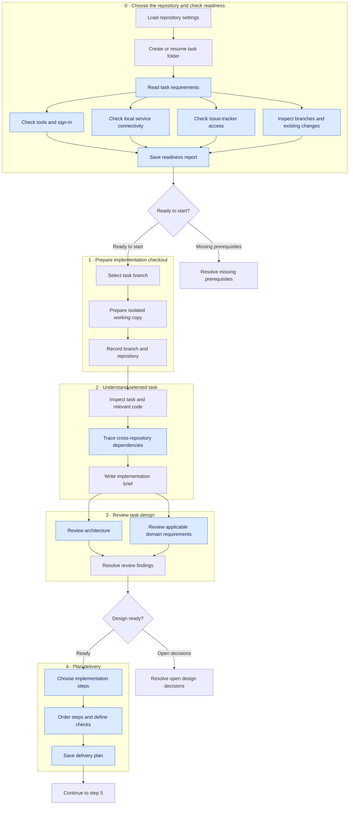
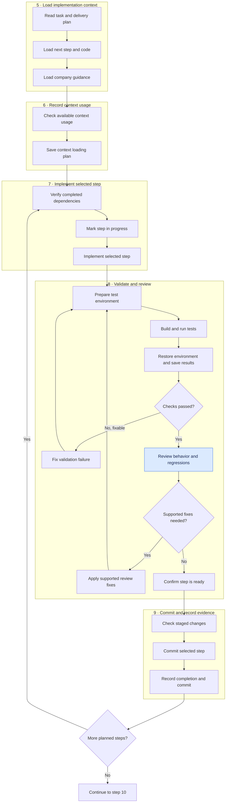
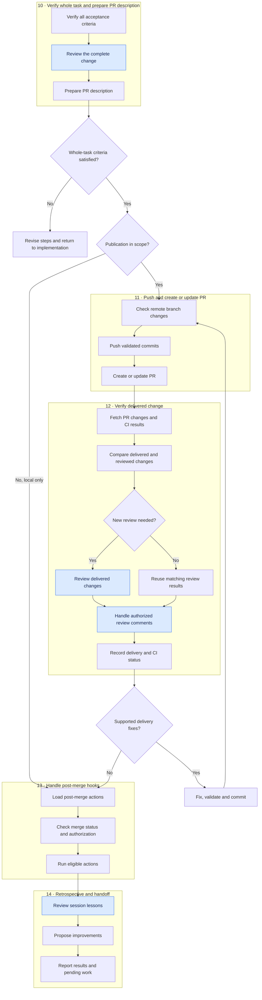
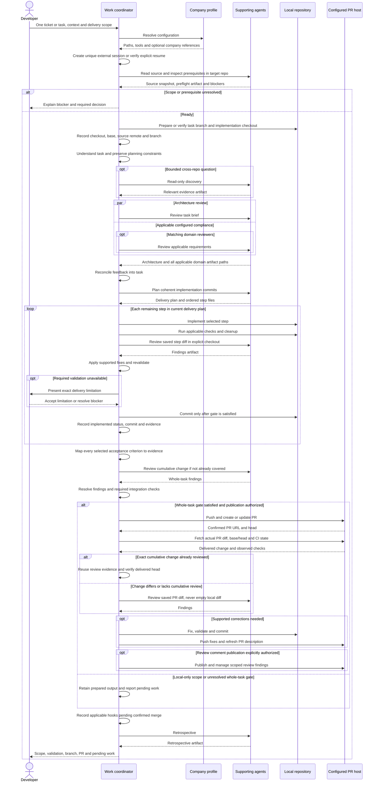

# Implementing a task with work

## When to use this skill

Use `/raholsn:work` to implement one actionable ticket or task through review,
validation, commits and a PR. It can follow the planning sequence
`grill-me-pragmatic` → `write-requirements` → `plan-implementation`: select one task from the resulting
plan and supply its relevant context. A whole backlog requires a task selection
before implementation begins.

## Motivation

Implementation needs a clear scope, useful review and evidence that the change
works. This skill carries a selected task from the planning record into an
implementation checkout, reviews and validates coherent commits, then verifies
the complete change and delivered PR. A durable session keeps the source,
decisions and delivery evidence together so interrupted work can resume. Company and
repository configuration supplies the tools, commands and conventions.

## Usage

```text
/raholsn:work TEAM-123
/raholsn:work Implement the selected retry task from the planning artifact
/raholsn:work Fix the timeout handling, keep this local and do not push
```

An existing ticket is read for its requirements even when you add instructions.
A description can run ticketless with a configured tracker; this command does
not automatically create tickets. Use [create-linear-ticket](create-linear-ticket.md)
when you want one created.

The normal invocation includes implementation commits, pushing the task branch
and creating or updating its PR. Narrower instructions such as local-only remain
in effect. Merging, deployment, publishing review comments and sending colleague
messages require separate authorization. The skill can prepare a colleague note
for you to copy.

## Workflow

### High-level overview

These diagrams describe the instructions in the
[`work` skill](../claude-plugin/skills/work/work.md), not a recorded execution.

Each large container is a numbered workflow step. Inside it, smaller boxes show
the checks in order. Blue boxes are agent work; their owners are listed below. Arrows between containers show
the next step or a loop. The flow is split into three consecutive panels so the
text stays readable.

#### Steps 0–4: Prepare and plan



The preflight agent checks whether work can start; it does not implement code or
create tickets. It checks developer tools, local services, tracker access and Git
state independently, so those checks can run in parallel. A responding service
port establishes connectivity, not full application health. Reference mappings
and agent responsibilities are listed below the flow diagrams.

Missing optional configuration is
recorded as skipped; a missing prerequisite blocks dependent work. Architecture
and applicable domain reviews also run in parallel.

#### Steps 5–9: Implement, validate and review



The inner loop fixes and revalidates the current change. The outer loop selects
the next planned implementation step. Unresolvable failures pause dependent work.
An explicit no-commit scope ends with validated local changes and pending commit
steps, rather than marking uncommitted work as implemented.

#### Steps 10–14: Verify and deliver



A whole-task gap returns to implementation. Delivery fixes repeat push and
verification after local validation and review. Identical reviewed changes reuse
their evidence. Published review findings require explicit authorization; the
workflow does not merge the PR or wait indefinitely for a merge.

### Supporting skills and agents

<details>
<summary>Show which agent and reference each step uses</summary>

| Step | Owner | Supporting skills |
|---|---|---|
| 0 · Settings and task folder | Main agent | `profile`, `ref-work-session` |
| 0 · Task and readiness checks | Preflight agent | `ref-ticket`, `ref-cli-check`, `ref-service-check`, `ref-mcp-check`, `ref-git-preflight` |
| 1 · Working copy | Main agent | Naming guidance from `ref-create-branch-and-pr` only |
| 2 · Task understanding | Main agent, optional cross-repo explorers | `ref-understand-task` |
| 3 · Design review | Architect and applicable domain agents, main agent reconciles | `ref-architect-review`, `ref-compliance-review`, `ref-apply-feedback` |
| 4 · Delivery plan | Planner agent | `ref-delivery-planning` |
| 5 · Implementation context | Main agent | Applicable company guidance |
| 6 · Context usage | Main agent | `ref-context-usage-report` |
| 7 · Implementation | Main agent | Selected implementation step |
| 8 · Validation and review | Main agent and functional reviewer | `ref-build-and-test`, `ref-review-loop` |
| 9 · Commit | Main agent | Repository commit conventions |
| 10 · Whole-task verification | Main agent and relevant reviewers | `ref-review-loop`, applicable architecture/domain references, `ref-update-pr-description` for an existing PR |
| 11 · PR delivery | Main agent | Configured host CLI |
| 12 · Delivered-change review | Main agent, functional reviewer, comment-fixer when authorized | `ref-review-loop`, optional `ref-post-push-review` |
| 13 · Post-merge actions | Main agent | Configured `post_merge_hooks` |
| 14 · Retrospective | Retrospective agent, main agent hands off | `ref-session-retrospective` |

</details>

### Detailed sequence

<details>
<summary>Expand implementation, delivery and handoff</summary>



</details>

## Decisions and boundaries

Consequential scope conflicts, unmet dependencies and missing required access
must be resolved before dependent work. The skill does not implement every issue
in a supplied plan or infer that a planning artifact authorizes external writes.

A failed check blocks delivery. A missing required check is reported as
unavailable and needs explicit acceptance of the delivery limitation before a
commit or push. Checks that do not apply need a reason. Skips are not passes.
Supported critical review findings must be fixed; unsupported claims require
evidence for rejection. Warnings can be left only with a specific, recorded rationale. Cleanup is attempted on failed validation as well as success.

Existing work is preserved. Branch reuse requires matching the selected task;
resuming reconciles step artifacts against actual commits and changed requirements.
Preflight inspects the checkout without stashing, switching or discarding work.
The coordinator creates an isolated checkout when needed and passes that path to
all subsequent steps. The workflow does
not create an empty commit merely to open a PR before implementation.

Per-step checks are followed by a whole-task gate: all selected acceptance
criteria need implementation and validation evidence, and cross-step behavior
needs appropriate coverage. Before claiming delivery, the actual PR base/head
and saved cumulative diff must match the reviewed change. An identical reviewed
change does not need a duplicate review just because it was pushed.

## Configuration

Configure company context through the [profile](profile.md).

| Setting | Purpose |
|---|---|
| `roots.repos`, `roots.artifacts` | Repository location and session artifacts outside checkouts |
| `guidance_file` | Repository instructions, setup and validation requirements |
| `vcs` | Base branch, naming, host CLI, commit title and draft preference |
| `tracker` | Optional access to the selected existing ticket |
| `toolchain`, `local_services` | Applicable prerequisite checks |
| `build` | Independently configured build and test commands, setup and cleanup |
| `pack`, `knowledge` | Optional conventions and domain references loaded as needed |
| `compliance` | Optional plan-stage compliance review |
| `post_merge_hooks` | Optional follow-ups after confirmed merge and authorization |
| `browser_open_cmd` | Optional opening of the confirmed PR URL |

Missing optional configuration skips the corresponding optional step. Missing
configuration needed for this task is resolved before relying on it. An absent
build command does not suppress configured tests. Commands are not guessed from
file names. A successful local check does not establish that host CI passed.

## Responsibilities

| Participant | Responsibility |
|---|---|
| Developer | Select the task, clarify product decisions and set delivery scope |
| Work coordinator | Reconcile evidence, implement, validate, commit and deliver within scope |
| Preflight and discovery agents | Check prerequisites and answer bounded evidence questions |
| Review agents | Assess architecture, configured compliance and functional correctness |
| Planner | Write the commit sequence and step-level validation requirements |
| Retrospective agent | Record lessons from the actual session |
| Company profile and repo guidance | Supply applicable tools, paths, commands and conventions |

References that delegate own their agents; the coordinator does not wrap them
in duplicate agent layers. Agent artifacts preserve decisions without carrying
all discovery output into implementation context.

## Results and recovery

A unique session directory outside checkouts is created before preflight. It
holds `session.md`, `.repo`, `.task`, `source-context.md`, `preflight.md`, `task.md`,
`delivery-plan.md`, `implementation-steps/*.md` and `context-usage.md`. Review inputs
and feedback are kept by step/attempt under `reviews/`, with delivered-head
evidence under `reviews/delivery/<head>/`. Validation logs are preserved per step. A step becomes
`implemented` only after its commit succeeds, with the commit SHA and validation
evidence recorded. The current plan explicitly identifies its active step files;
archived files do not re-enter the implementation loop. An explicit no-commit
request produces validated local changes and a report of pending commits. It does
not mark uncommitted steps as implemented.

To resume, supply the recorded session path and selected task. The skill verifies
its repository, checkout, branch and commits, preserves completed evidence, and
resumes the first incomplete phase. It does not recreate the plan or overwrite
another task just because the branch names match.

The handoff reports completed scope, validation and limitations, the checkout,
session path, branch and
PR URL when present, unresolved findings and pending actions. An uncertain push
or PR creation is checked against remote state before retrying. A failed PR
creation does not discard the pushed branch.

This workflow ends at a PR handoff without waiting indefinitely for a merge.
Configured hooks remain pending until the intended PR is confirmed merged and
the follow-up action is authorized. Completed hooks are recorded so a resumed
session does not repeat them. A blocked run reports the current step, attempts,
blocker and decision needed to resume.
