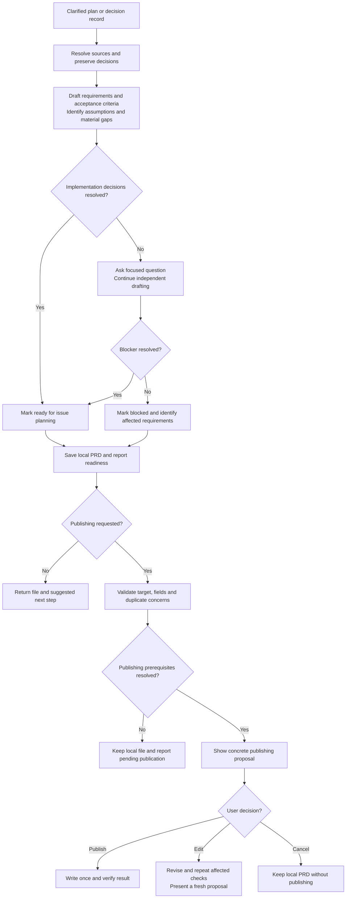
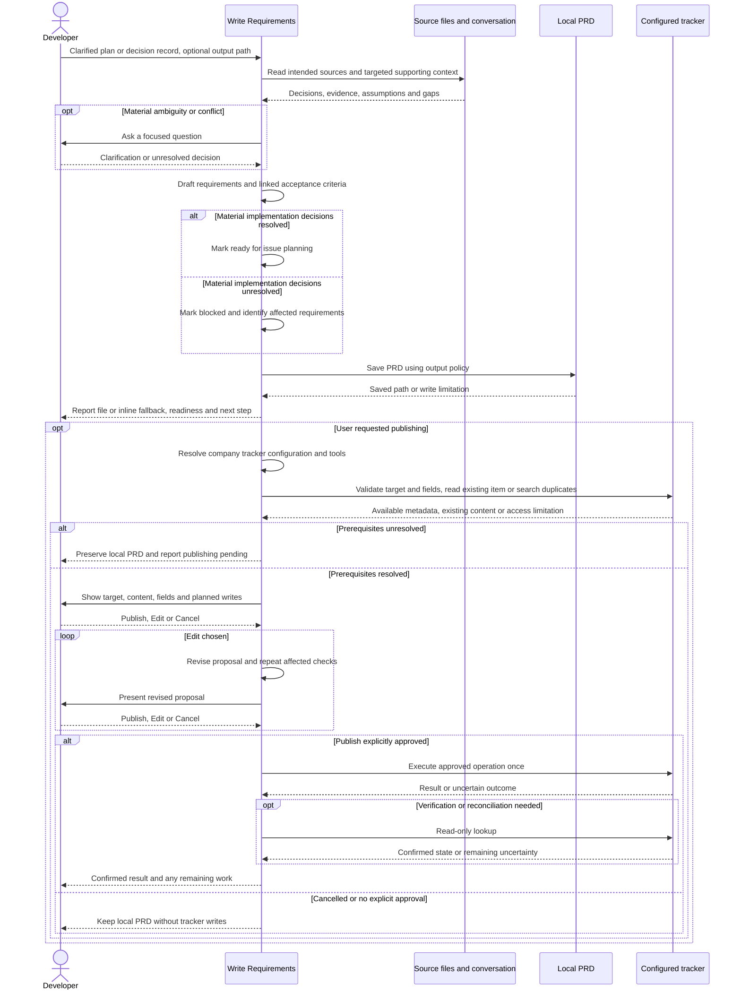

# Writing a PRD with write-requirements

## When to use this skill

Use `/raholsn:write-requirements` after [grill-me-pragmatic](grill-me-pragmatic.md) has
clarified a plan. It turns the decision record and relevant context into a local
product requirements document for the next planning step, `/raholsn:plan-implementation`.
You can also supply a sufficiently clarified plan directly.

## Motivation

A useful PRD preserves the decisions from planning and makes the expected
behavior testable. This skill carries those decisions forward, exposes assumptions
and identifies missing decisions that would change implementation. It avoids
restarting discovery or calling an unresolved draft implementation-ready.

## Usage

```text
/raholsn:write-requirements docs/planning/2026-09-14-example-grill-decisions.md
/raholsn:write-requirements Turn our clarified plan into a PRD at docs/prds/example-prd.md
/raholsn:write-requirements Revise docs/prds/example-prd.md with the decisions above
```

The default result is a markdown file. No company profile or tracker is needed.
Publishing is optional and requires an explicit request followed by approval of
the concrete publishing proposal. There is no `--auto` publishing mode.

## Workflow

### High-level overview

These diagrams describe the instructions in the
[`write-requirements` skill](../claude-plugin/skills/write-requirements/write-requirements.md), not a recorded execution.



### Detailed sequence

<details>
<summary>Expand drafting, readiness and optional publishing</summary>



</details>

## Sources, assumptions and readiness

The supplied source and active planning conversation determine the PRD. The skill
reads files before using them, reports unavailable sources and asks when several
sources could be intended. Later explicit user corrections take precedence;
other material contradictions are surfaced rather than silently resolved.

Low-risk gaps can become visible assumptions. Decisions that could change scope,
behavior, contracts or acceptance criteria require clarification. Independent
sections can still be drafted while a decision remains open.

| Status | Meaning |
|---|---|
| **Ready for issue planning** | Requirements and acceptance criteria are concrete enough to break into issues, with explicit low-risk assumptions. |
| **Blocked** | An unresolved implementation decision affects named requirements. The saved document is a draft. |

Rollout-only prerequisites are recorded separately with their required release
conditions. Readiness does not mean the user has approved publishing,
implementation or release. The skill does not claim research, stakeholder
agreement or compliance conclusions that the sources do not establish.

## Document contents

The PRD contains its sources and readiness, problem, goals and non-goals, users,
requirements, acceptance criteria, implementation decisions, testing strategy,
relevant operational considerations, risks, assumptions and open questions.
Detail stays proportional to the work; irrelevant sections do not need invented
content.

Requirements have stable IDs such as `R1`. Acceptance criteria have IDs such as
`AC1` and reference the requirements they validate. Those references make coverage
traceable when `/raholsn:plan-implementation` creates the issue breakdown. Revisions preserve
existing IDs.

## File location and revisions

An explicit output path takes precedence. Otherwise the skill prefers an existing
PRD or planning directory, such as `docs/prds/`, `docs/planning/`,
`docs/requirements/`, `planning/` or `prd/`. If none exists, it creates
`docs/prds/` under the current working directory.

The default filename is `YYYY-MM-DD-<short-prd-slug>-prd.md`. New documents do not
silently overwrite existing files. An explicit revision updates the intended PRD,
preserving unrelated edits and stable IDs. The source decision record is preserved.
If writing is unavailable, the skill provides inline output and states that it
was not saved. Inline-only output can also be requested.

## Optional publishing and configuration

Publishing uses the [company profile](profile.md) only when requested. Its
`tracker` block identifies the configured connection and defaults; available tool
schemas and tracker metadata determine supported fields and operations. Missing
configuration leaves publishing pending and preserves the local result.

The skill resolves create versus update, checks the destination and fields,
and checks for plausible duplicates before creating. For updates, it reads the
existing item and shows the proposed changes while preserving unrelated content.
A source issue reference alone does not authorize changing that issue.

| Decision | Result |
|---|---|
| **Publish** | Execute the displayed operation, content, fields and planned follow-up writes. |
| **Edit** | Revise the proposal, repeat affected checks and request fresh approval. |
| **Cancel** | Keep the local PRD without tracker writes. |

An initial publishing request, silence or an ambiguous reply does not approve the
final proposal. A blocked PRD can be published only as a clearly identified draft
with explicit approval.

## Responsibilities

| Participant | Responsibility |
|---|---|
| Developer | Supply planning intent, resolve material decisions and approve optional publishing. |
| Skill | Preserve source decisions, write testable requirements, assess readiness, save the PRD and verify authorized publication. |
| Local context | Supply evidence for terminology, existing behavior and constraints. |
| Company profile and tracker | Supply publishing configuration, supported metadata and confirmed write results when publishing is requested. |

## Results and next steps

The skill returns the PRD path and a compact summary of readiness and remaining
decisions. A ready PRD can be passed to `/raholsn:plan-implementation <prd-path>` for planning
the implementation slices. A blocked draft identifies the decisions needed first.
Neither result automatically starts another command or implements the plan.

A successful publication also returns the confirmed tracker URL and fields.
Uncertain writes are reconciled through read-only lookup, without blind retries.
Partial success reports the existing item and incomplete work rather than creating
a replacement. Retries and repairs require fresh explicit approval.
